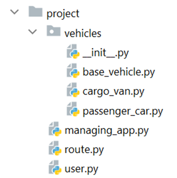

Problem description 

Python OOP Retake Exam - 18 April 2023

            E-Drive Rent

You are chosen to take part in a Start-up company, which develops an electric vehicles rent-a-car application. Your task is to create the classes needed for the application and implement the logic, standing behind some important buttons. The application should support User, Vehicle, and Route. The project has a managing app that controls and interacts with users, vehicles, and routes.
You will be provided with a skeleton that includes all the folders and files that you will need.
Note: You are not allowed to change the folder and file structure and change their names!

Judge Upload
For the first two problems, create a zip file with the project folder and upload it to the judge system.
For the last problem, create a zip file with the test folder and upload it to the judge system.
You do not need to include in the zip file your venv, .idea, pycache, and __MACOSX (for Mac users), so you do not exceed the maximum allowed size of 16.00 KB.
Structure (Problem 1) and Functionality (Problem 2)
Our task is to implement the structure and functionality of all the classes (properties, methods, inheritance, abstraction, etc.)
You are free to add additional attributes (instance attributes, class attributes, methods, dunder methods, etc.) to simplify your code and increase readability as long as it does not change the project's final result in accordance with its requirements so that the program works properly.

1.	Class User
In the user.py file, the class User should be implemented.
Structure
The class should have the following attributes: 
•	first_name: str
o	The value represents the user’s first name.
o	If the first name is an empty string or contains only white spaces, raise a ValueError with the message: "First name cannot be empty!"
•	last_name: str
o	The value represents the user’s last name.
o	If the last name is an empty string or contains only white spaces, raise a ValueError with the message: "Last name cannot be empty!" 
•	driving_license_number: str
o	The value represents the user’s driving license number.
o	If the driving license number is an empty string or contains only white spaces, raise a ValueError with the message: "Driving license number is required!"
•	rating: float
o	The value represents the user’s rating.
o	Set the rating’s initial value to 0 (zero). The value of the rating will be changed every time a user drives a vehicle. 
o	If the rating is less than 0 (zero), raise a ValueError with the message: "Users rating cannot be negative!"
•	is_blocked: bool
o	The value represents the user’s blocked status.
o	Set is_blocked initially to false.
Methods
__init__(first_name: str, last_name: str, driving_license_number: str)
•	In the __init__ method, all the needed attributes must be set.
increase_rating()
•	This method increases the rating by 0.5:
•	If the rating’s value exceeds 10, set the value to 10.
decrease_rating()
•	This method decreases the rating by 2.0:
•	If the rating’s value drops below 0 (zero), set the value to 0 (zero) and is_blocked value to true.
__str__()
•	Returns information about each user in the following format:
"{first_name} {last_name} Driving license: {driving_license_number} Rating: {rating}"
2.	Class BaseVehicle
In the base_vehicle.py file, the class BaseVehicle should be implemented. It is a base class for any type of Vehicle, and it should not be able to be instantiated.
Structure
The class should have the following attributes: 
•	brand: str
o	The value represents the brand of the vehicle.
o	If the brand is an empty string or contains only white spaces, raise a ValueError with the message: "Brand cannot be empty!"
•	model: str
o	The value represents the model of the vehicle.
o	If the model is an empty string or contains only white spaces, raise a ValueError with the message: "Model cannot be empty!"
•	license_plate_number: str
o	The value represents the license plate number of the vehicle.
o	If the license plate number is an empty string or contains only white spaces, raise a ValueError with the message: "License plate number is required!"
•	max_milеage: float
o	The value represents the maximum mileage of the vehicle.
•	battery_level: int
o	The value represents the battery level of the vehicle.
o	Set battery level initially to 100. This represents a full charge of 100%. The value of the battery level will be changed every time a user drives a vehicle, or the vehicle has been recharged. 
•	is_damaged: bool
o	The value represents the damage status of the vehicle.
o	Set is_damaged initial value to false.
Methods
__init__(brand: str, model: str, license_plate_number: str, max_mileage: float)
•	In the __init__ method, all the needed attributes must be set.
drive(mileage: float)
•	The method reduces the battery level by a certain percentage. Each type of vehicle implements this method differently.
recharge()
•	This method restores the value of the battery level to 100%.
change_status()
•	This method sets the value of is_damaged. 
o	If the value is false, set it to true
o	otherwise, set it to false.
__str__()
•	Returns a string in the given format. "OK" or "Damaged" string depends on the damage status of the vehicle:
"{brand} {model} License plate: {license_plate_number} Battery: {battery_level}% Status: OK/Damaged"

3.	Class PassengerCar
In the passenger_car.py file implement the PassengerCar class. It is a type of BaseVehicle car. It has a constant value for max_mileage = 450.00
Methods
__init__(brand: str, model: str, license_plate_number: str)
•	In the __init__ method, all the needed attributes must be set.
drive(mileage: float)
•	The method reduces the battery level by a certain percentage. First, compute what part of the max_mileage will be passed (for example: if the given mileage is 90 kilometers and the vehicle’s max mileage is 180 kilometers, then you should reduce the battery level by 50%), then reduce the battery level with the calculated value. The percentage should be rounded to the closest integer number.

4.	Class CargoVan
In the cargo_van.py file implement the CargoVan class. It is a type of BaseVehicle car. It has a constant value for max_mileage = 180.00
Methods
__init__(brand: str, model: str, license_plate_number: str )
•	In the __init__ method, all the needed attributes must be set.
drive(mileage: float)
•	The method reduces the battery level by a certain percentage. First, compute what part of the max_mileage will be passed (for example: if the given mileage is 90 kilometers and the vehicle’s max mileage is 180 kilometers, then you should reduce the battery level by 50%), then reduce the battery level with the calculated value. Also, when driving CargoVan, you should reduce an additional 5%, because of the load.  The percentage should be rounded to the closest integer number.

5.	Class Route
In the route.py file, the class Route should be implemented.
Structure
The class should have the following attributes: 
•	start_point:  str
o	The value represents the start point of the route.
o	If the start point is an empty string or contains only white spaces, raise a ValueError with the message: "Start point cannot be empty!"
•	end_point: str
o	The value represents the end point of the route.
o	If the end point is an empty string or contains only white spaces, raise a ValueError with the message: "End point cannot be empty!"
•	length: float
o	The value represents the length of the route in kilometers.
o	If the length is less than 1.00, raise a ValueError with the message: "Length cannot be less than 1.00 kilometer!"
•	route_id: int
o	The value represents the id of the route.
•	is_locked: bool
o	The value represents the status of the route.
o	Set is_locked initial value to false.
Methods
__init__(start_point: str, end_point: str, length: float, route_id: int)
•	In the __init__ method, all the needed attributes must be set.

6.	Class ManagingApp
In the managing_app.py file, the class ManagingApp should be implemented. It will contain the functionality of the project.
Structure
The class should have the following attributes:
•	users: list
o	Empty list that will contain all users (objects) that are created.
•	vehicles: list
o	Empty list that will contain all vehicles (objects) that are created.
•	routes: list
o	Empty list that will contain all routes (objects) that are created.
Methods
__init__()
•	In the __init__ method, all the needed attributes must be set.
register_user(first_name: str, last_name: str, driving_license_number: str)
The method should create and add a new user to the users’ collection.
•	If there is already a user with the same driving license number, return the following message:
"{driving_license_number} has already been registered to our platform."
•	Otherwise, create and add the new user to the users’ list. Return the following message: 
"{first_name} {last_name} was successfully registered under DLN-{driving_license_number}"
upload_vehicle(vehicle_type: str, brand: str, model: str, license_plate_number: str)
The method should create and add a new vehicle to the vehicle collection.
•	First, check If the given vehicle type  is NOT a valid type (PassengerCar or CargoVan), and return the following message:
"Vehicle type {vehicle_type} is inaccessible."
•	Then, check If there is already a vehicle with the same license plate number, and return the following message:
"{license_plate_number} belongs to another vehicle."
•	If none of the above cases is reached, create the correct type of vehicle and add it to the vehicles list. Return the following message: 
"{brand} {model} was successfully uploaded with LPN-{license_plate_number}."
allow_route(start_point: str, end_point: str, length: float)
The method should create and add a new route to the routes’ collection.
Hint: route_id is expected. So it should be created by taking the count of already added routes in the routes list + 1.
•	If there is already a route with the given start point, end point, and length, return the following message:
"{start_point}/{end_point} - {length} km had already been added to our platform."
•	If there is already a route with the given start point, end point and its length is less than the given length, return the following message: 
"{start_point}/{end_point} shorter route had already been added to our platform."
•	If none of the above cases was reached, create a new route and add it to the routes list. 
o	Return the following message: 
"{start_point}/{end_point} - {length} km is unlocked and available to use."
o	If there is already a route with the given start point, end point, and greater length, lock the longer route. 
make_trip(driving_license_number: str, license_plate_number: str, route_id: int,  is_accident_happened: bool)
•	There will always be a user with the corresponding driving license number, already added to the users’ list.
•	There will always be a vehicle with the corresponding license plate number, already added to the vehicles list.
•	There will always be a route with the corresponding route id, already added to the routes list.
•	The vehicle will always have enough battery to finish the trip.
A user with the given driving license number will take a trip on the route with specified route id and vehicle with stated license plate number:
•	First, check If the user with the given driving license number is blocked (is_blocked = True) in the application, cancel the trip and return the following message: 
"User {driving_license_number} is blocked in the platform! This trip is not allowed."
•	Then, check If the vehicle with the given license plate number is damaged (is_damaged = True) in the application, cancel the trip and return the following message: 
"Vehicle {license_plate_number} is damaged! This trip is not allowed."
•	Afterwards, check If the route with the given route id is locked (is_locked = True) in the application, cancel the trip and return the following message: 
"Route {route_id} is locked! This trip is not allowed."
•	Drive the specific vehicle on the specific route. The trip should take effect on the battery level of the vehicle.
•	If the value of the parameter is_accident_happened is true, the is_damaged status of the vehicle should be changed to true. The rating of the user who has rented the vehicle should be decreased.
•	Otherwise, increase the user’s rating.
•	 Return actual information about the vehicle, after making the trip, in the following format: 
"{brand} {model} License plate: {license_plate_number} Battery: {battery_level}% Status: OK/Damaged"
"OK" or "Damaged" string depends on the damaged status of the vehicle.
repair_vehicles(count: int)
The method should select only those vehicles from the vehicles’ collection, which are damaged. Order the selected vehicles alphabetically by their brand, then alphabetically by their model. Take the first {count} vehicles, if there are more damaged vehicles, otherwise take all of the damaged vehicles. The count will be a positive integer or zero. 
•	Each of the chosen vehicles will be repaired (is_damaged = False) and recharged (battery level restored to 100%).
•	Return the following message: 
"{count_of_repaired_vehicles} vehicles were successfully repaired!"
users_report()
Returns information about each user from the users’ collection. Arrange the users by rating, descending. To get the correct output, use the __str__() method of each user. The output for each user should be on a new line:
"*** E-Drive-Rent ***
{user1} 
{user2}
...
{usern}"

_______________________________________________
Examples

Input

app = ManagingApp()
print(app.register_user( 'Tisha', 'Reenie', '7246506' ))
print(app.register_user( 'Bernard', 'Remy', 'CDYHVSR68661'))
print(app.register_user( 'Mack', 'Cindi', '7246506'))
print(app.upload_vehicle('PassengerCar', 'Chevrolet', 'Volt', 'CWP8032'))
print(app.upload_vehicle( 'PassengerCar', 'Volkswagen', 'e-Up!', 'COUN199728'))
print(app.upload_vehicle('PassengerCar', 'Mercedes-Benz', 'EQS', '5UNM315'))
print(app.upload_vehicle('CargoVan', 'Ford', 'e-Transit', '726QOA'))
print(app.upload_vehicle('CargoVan', 'BrightDrop', 'Zevo400', 'SC39690'))
print(app.upload_vehicle('EcoTruck', 'Mercedes-Benz', 'eActros', 'SC39690'))
print(app.upload_vehicle('PassengerCar', 'Tesla', 'CyberTruck', '726QOA'))
print(app.allow_route('SOF', 'PLD', 144))
print(app.allow_route('BUR', 'VAR', 87))
print(app.allow_route('BUR', 'VAR', 87))
print(app.allow_route('SOF', 'PLD', 184))
print(app.allow_route('BUR', 'VAR', 86.999))
print(app.make_trip('CDYHVSR68661', '5UNM315', 3, False))
print(app.make_trip('7246506', 'CWP8032', 1, True))
print(app.make_trip('7246506', 'COUN199728', 1, False))
print(app.make_trip('CDYHVSR68661', 'CWP8032', 3, False))
print(app.make_trip('CDYHVSR68661', '5UNM315', 2, False))
print(app.repair_vehicles(2))
print(app.repair_vehicles(20))
print(app.users_report())

_______________________________________________

Output

Tisha Reenie was successfully registered under DLN-7246506
Bernard Remy was successfully registered under DLN-CDYHVSR68661
7246506 has already been registered to our platform.
Chevrolet Volt was successfully uploaded with LPN-CWP8032.
Volkswagen e-Up! was successfully uploaded with LPN-COUN199728.
Mercedes-Benz EQS was successfully uploaded with LPN-5UNM315.
Ford e-Transit was successfully uploaded with LPN-726QOA.
BrightDrop Zevo400 was successfully uploaded with LPN-SC39690.
Vehicle type EcoTruck is inaccessible.
726QOA belongs to another vehicle.
SOF/PLD - 144 km is unlocked and available to use.
BUR/VAR - 87 km is unlocked and available to use.
BUR/VAR - 87 km had already been added to our platform.
SOF/PLD shorter route had already been added to our platform.
BUR/VAR - 86.999 km is unlocked and available to use.
Mercedes-Benz EQS License plate: 5UNM315 Battery: 81% Status: OK
Chevrolet Volt License plate: CWP8032 Battery: 68% Status: Damaged
User 7246506 is blocked in the platform! This trip is not allowed.
Vehicle CWP8032 is damaged! This trip is not allowed.
Route 2 is locked! This trip is not allowed.
1 vehicles were successfully repaired!
0 vehicles were successfully repaired!
*** E-Drive-Rent ***
Bernard Remy Driving license: CDYHVSR68661 Rating: 0.5
Tisha Reenie Driving license: 7246506 Rating: 0

_______________________________________________

Task 3: Unit Tests (100 points)
You will be provided with another skeleton for this problem. Open the new skeleton as a new project and write tests for the Robot class. The class will have some methods, fields, and one constructor, all of them working properly. You are NOT ALLOWED to change anything in the class. Cover the whole class with unit tests to make sure that the class is working as intended. Submit only the test folder as zip archive.

_______________________________________________