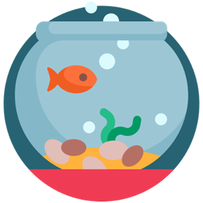
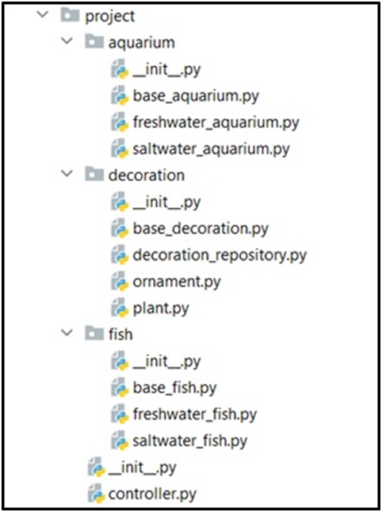

Problem description 

Python OOP Exam - 10 April 2021

Aquariums are nice and interesting species can live in there. You have to create an aqua shop project, which keeps track of the fish in the aquariums. The Aquariums have Fish with different environment requirements. Your task is to add, feed and take care of the fish.
You will be provided with a skeleton which includes all the folders and files that you will need. 
Note: You are not allowed to change the folder and file structure and change their names!

Judge Upload
For the first 2 problems, create a zip file with the name project and upload it to the judge system
For the last problem, create a zip file with the name tests and upload it to the judge system
Structure (Problem 1) and Functionality (Problem 2)
Our first task is to implement the structure and functionality of all the classes (properties, methods, inheritance, etc.)
You are free to add additional attributes (instance attributes, class attributes, methods, dunder methods, etc.) to simplify your code and increase readability as long as it does not change the project's final result according to the requirements and the program works properly.
1.	BaseDecoration
In the base_decoration.py file the class BaseDecoration should be implemented. It is a base class of any type of decoration, and it should not be able to be instantiated.
Structure
The class should have the following attributes:
•	comfort: int - passed upon initialization. 
•	price: float - passed upon initialization.
Methods
__init__(comfort: int, price: float)
The __init__ method should have a comfort and price. 

2.	Ornament
In the file ornament.py the class Ornament should be implemented.
Structure
The class should inherit from the BaseDecoration class.
Methods
__init__()
An instance of the Ornament class will have 1 comfort and its price is 5.

3.	Plant
In the file plant.py the class Plant should be implemented.
Structure
The class should inherit from the BaseDecoration class.
Methods
__init__()
An instance of the Plant class will have 5 comfort and its price is 10.

4.	DecorationRepository
In the file decoration_repository.py the class DecorationRepository should be implemented. It is a repository for the decorations that are in the aqua shop.
Structure
The class should have the following attributes:
•	decorations: list – empty list that will contain all decorations (objects).
Methods
__init__()
The __init__ method should have an empty list of decorations. 
add(decoration)
•	Adds a decoration object in the list.
remove(decoration)
•	Removes the decoration object from the list if it exists and returns True, otherwise returns False.
find_by_type(decoration_type: str)
•	Returns the first decoration of the given type if there is. Otherwise, returns a message "None".

5.	BaseFish
In the base_fish.py file the class BaseFish should be implemented. It is a base class of any type of fish, and it should not be able to be instantiated.
Structure
The class should have the following attributes:
•	name: string - passed upon initialization. If the name is empty string, raise a ValueError with message "Fish name cannot be an empty string."
o	All passed names would be unique and it will not be necessary to check if a given name already exists.
•	species: string - passed upon initialization. If the species is empty string, raise a ValueError with message "Fish species cannot be an empty string."
•	size: int - passed upon initialization. 
•	price: float - passed upon initialization. It represents the price of the fish. If the price is equal to or below 0, raise a ValueError with message "Price cannot be equal to or below zero."
Methods
__init__(name: str, species: str, size: int, price: float)
The __init__ method should have a name, a species, a size and a price.  
eat()
The eat() method increases the Fish's size. Keep in mind that some types of Fish can implement the method in a different way. 
•	The method increases the fish’s size by 5.

6.	FreshwaterFish
In the file freshwater_fish.py the class FreshwaterFish should be implemented. The FreshwaterFish could only live in FreshwaterAquarium!
Structure
The class should inherit from the BaseFish class.
Methods
__init__(name: str, species: str, price: float)
An instance of the FreshwaterFish class should have a name, a species, a price upon initialization and will have 3 initial size.
еat()
The method increases the fish’s size by 3.

7.	SaltwaterFish	
In the file saltwater_fish.py the class SaltwaterFish should be implemented. The SaltwaterFish could only live in SaltwaterAquarium!
Structure
The class should inherit from the BaseFish class.
Methods
__init__(name: str, species: str, price: float)
An instance of the SaltwaterFish class should have a name, a species, a price upon initialization and will have 5 initial size.
eat()
The method increases the fish’s size by 2.

8.	BaseAquarium
In the base_aquarium.py file the class BaseAquarium should be implemented. It is a base class of any type of aquarium, and it should not be able to be instantiated.
Structure
The class should have the following attributes:
•	name: string - passed upon initialization. If the name is empty string, raise a ValueError with message: "Aquarium name cannot be an empty string."
o	All passed names would be unique and it will not be necessary to check if a given name already exists.
•	capacity:  int - passed upon initialization. It represents the number of fish an aquarium can have.
•	decorations: list - empty list upon initialization that will contain all the decorations (objects).
•	fish: list - empty list upon initialization that will contain all the fish (objects).

Methods
__init__(name: str, capacity: int)
The __init__ method should have a name, a capacity, decorations and fish.  
calculate_comfort()
Returns the sum of each decoration’s comfort in the Aquarium.
add_fish(fish)
Adds a fish (object) in the Aquarium and return one of the following strings:
•	"Not enough capacity." - if there is not enough capacity to add the Fish in the Aquarium
•	"Successfully added {fish_type} to {aquarium_name}." - if the Fish is added successfully in the Aquarium
o	Possible fish_types are: "FreshwaterFish" and "SaltwaterFish".
remove_fish(fish)
Removes a fish object from the Aquarium.
add_decoration(decoration)
Adds a decoration object in the Aquarium.
feed()
The feed() method feeds all fish in the aquarium.
__str__()
Returns a String with information about the Aquarium in the format below. If the Aquarium does not have fish, you should replace the fish names with the word "none" instead.
"{aquarium name}:
Fish: {fish_name1} {fish_name2} {fish_name3} (…) / none
Decorations: {decorations_count}
Comfort: {aquarium_comfort}"

9.	FreshwaterAquarium
In the file freshwater_aquarium.py the class FreshwaterAquarium should be implemented.
Structure
The class should inherit from the BaseAquarium class.
Methods
__init__(name: str)
An instance of the FreshwaterAquarium class should have a name upon initialization and 50 initial capacity.

10.	SaltwaterAquarium
In the file saltwater_aquarium.py the class SaltwaterAquarium should be implemented.
Structure
The class should inherit from the BaseAquarium class.
Methods
__init__(name: str)
An instance of the SaltwaterAquarium class should have a name upon initialization and 25 initial capacity.

11.	Controller
In the file controller.py the class Controller should be implemented.
Structure
The class should have the following attributes:
•	decorations_repository: DecorationRepository – new decoration repository upon initialization.
•	aquariums: list – empty list upon initialization that will contain all aquariums (objects).
Methods
__init__()
An instance of the Controller class will have decorations_repository and aquariums.
add_aquarium(aquarium_type: str, aquarium_name: str)
Creates an aquarium of the given type and then adds it to the list of aquariums. Valid types are: "FreshwaterAquarium" and "SaltwaterAquarium".
If the aquarium type is invalid, you should return the following message:
•	"Invalid aquarium type."
If the Aquarium is added successfully, the method should return the following message:
•	"Successfully added {aquarium_type}."
add_decoration(decoration_type: str)
Creates a decoration of the given type and adds it to the DecorationRepository. Valid types are: "Ornament" and "Plant". 
If the decoration type is invalid, return the following message:
•	"Invalid decoration type."
The method should return the following string if the operation is successful:
•	"Successfully added {decoration_type}."
insert_decoration(aquarium_name: str, decoration_type: str)
If there is such decoration and such aquarium, you should add the first occurrence of the desired decoration to the aquarium with the given name. You should remove the decoration from the DecorationRepository and return the following message:
•	"Successfully added {decoration_type} to {aquarium_name}."
If there is no such decoration, you should return the following message:
•	"There isn't a decoration of type {decoration_type}."
add_fish(aquarium_name: str, fish_type: str, fish_name: str, fish_species: str, price: float)
Creates a fish of the given type and adds it to the aquarium with the given name. Valid fish types are: "FreshwaterFish" and "SaltwaterFish". If the fish type is invalid, you should return a massage:
•	"There isn't a fish of type {fish_type}."
If the fish type is valid, return one of the following strings:
•	"Not enough capacity." - if there is not enough capacity to add the fish in the aquarium.
•	"Water not suitable." - if the fish cannot live in the aquarium.
•	"Successfully added {fish_type} to {aquarium_name}." - if the fish is added successfully in the aquarium.
You can use the overridden add_fish Aquarium method.
feed_fish(aquarium_name: str)
Feeds all fish in the aquarium with the given name.
Returns a string with information about how many fish were successfully fed, in the following format:
•	"Fish fed: {fed_count}"
calculate_value(aquarium_name: str)
Calculates the value of the aquarium with the given name. It is calculated by the sum of all fish’s and decorations’ prices in the aquarium.
Return a string in the following format:
•	"The value of Aquarium {aquarium_name} is {value}."
o	The value should be formatted to the 2nd decimal place!
report()
Returns information about each aquarium. You can use the overridden __str__ Aquarium method.
"{aquarium name1}:
Fish: {fish_name1} {fish_name2} {fish_name3} (…) / none
Decorations: {decorations_count}
Comfort: {aquarium_comfort}
{aquarium name2}:
Fish: {fish_name1} {fish_name2} {fish_name3} (…) / none
Decorations: {decorations_count}
Comfort: {aquarium_comfort}
…
{aquarium nameN}:
Fish: {fish_name1} {fish_name2} {fish_name3} (…) / none
Decorations: {decorations_count}
Comfort: {aquarium_comfort}"

_______________________________________________

Problem 3. Unit Tests
You will be provided with another skeleton for this problem. Import the new skeleton and write tests for the Train class. The class will have some methods, fields and one constructor, which are working properly. You are NOT ALLOWED to change any class. Cover the whole class with unit tests to make sure that the class is working as intended. Submit only the test folder.

_______________________________________________