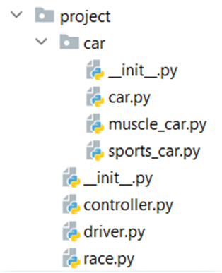

Problem description 

Python OOP Exam - Christmas Races
Christmas is around the corner, and the annual Christmas races are about to begin. You are their biggest fan, so the Christmas races federation hired you to create a platform for storing information about drivers, cars, and races.
You will be provided with a skeleton that includes all the folders and files that you will need.
Note: You are not allowed to change the folder and file structure and change their names!

Judge Upload
For the first 2 problems, create a zip file with the project folder and upload it to the judge system
For the last problem, create a zip file with the tests folder and upload it to the judge system
Structure (Problem 1) and Functionality (Problem 2)
Our first task is to implement the structure and functionality of all the classes (properties, methods, inheritance, etc.)
You are free to add additional attributes (instance attributes, class attributes, methods, dunder methods, etc.) to simplify your code and increase readability as long as it does not change the project's final result according to the requirements and the program works properly.
1.	Class Car
In the file car.py, the class Car should be implemented. It is a base class for any type of car, and it should not be able to be instantiated.
Structure
The class should have the following attributes:
•	model: str
o	If the model is less than 4 symbols, raise a ValueError with the message "Model {model} is less than 4 symbols!"
•	speed_limit: int
o	Every type of car has a different range of speed limit. If it is not in the valid range, raise a ValueError with the message "Invalid speed limit! Must be between {min_speed_limit} and {max_speed_limit}!"
o	All speed limit values will be unique. You do NOT need to check it explicitly.
•	is_taken: bool
o	The default value is False.
o	One car can be driven by ONLY one driver.
Methods
__init__(model: str, speed_limit: int)
In the __init__ method all the needed attributes must be set.
2.	Class MuscleCar
In the muscle_car.py file, the class MuscleCar should be implemented. It is a type of car. Each muscle car's minimum speed limit is 250, and its maximum speed limit is 450 (inclusive).
3.	Class SportsCar
In the sports_car.py file, the class SportsCar should be implemented. It is a type of car. Each sports car's minimum speed limit is 400, and its maximum speed limit is 600 (inclusive).
4.	Class Driver
In the driver.py file, the class Driver should be implemented. It will store the info of each driver.
Structure
The class should have the following attributes:
•	name: str
o	If the name is an empty string or contains only white spaces (one or many), raise a ValueError with the message "Name should contain at least one character!"
•	car: Car
o	The default value is None.
o	One driver drives ONLY one car.
•	number_of_wins: int
o	The default value is 0.
o	When the driver wins a race, the number of wins should be increased!
Methods
__init__(name: str)
In the __init__ method all the needed attributes must be set.
5.	Class Race
In the race.py file, the class Race should be implemented. It will store the info of each race.
Structure
The class should have the following attributes:
•	name: str
o	If the name is an empty string, raise a ValueError with the message "Name cannot be an empty string!"
•	drivers: list
o	An empty list that will contain all the drivers (objects) participating in the race 
Methods
__init__(name: str)
In the __init__ method all the needed attributes must be set.
6.	Class Controller
In the controller.py file, the class Controller should be implemented. It will contain all the functionality of the project.
Structure
The class should have the following attributes:
•	cars: list
o	An empty list that will contain all cars (objects)
•	drivers: list
o	An empty list that will contain all drivers (objects)
•	races: list
o	An empty list that will contain all races (objects)
Methods
__init__()
In the __init__ method all the needed attributes must be set.
create_car(car_type: str, model: str, speed_limit: int)
•	Create a car with the provided model and speed limit and add it to the cars' list.
•	If the car is successfully created, the method should return the message "{car_type} {model} is created."
•	If the car of the same model already exists, raise an Exception with the message "Car {model} is already created!"
•	The valid car types are "MuscleCar" and "SportsCar". In any other case, ignore the command.
create_driver(driver_name: str)
•	Creates a driver with the given name and adds it to the drivers' list. 
•	If the driver is successfully created, the method should return the message "Driver {name} is created."
•	If a driver with the given name already exists, raise an Exception with the message "Driver {name} is already created!"
create_race(race_name: str)
•	Creates a race with the given name and adds it to the races' list.
•	If the race is successfully created, the method should return the message "Race {name} is created."
•	If the race with the given name already exists, throw an Exception with the message "Race {name} is already created!"
add_car_to_driver(driver_name: str, car_type: str)
•	Set the last car added from the given type to the driver with the given name (if they both exist).
•	If the driver does not exist in the drivers' list, raise an Exception with the message "Driver {name} could not be found!"
•	If there is no available car (all cars from that type are taken or does not exist) from the given type in the cars' list, raise an Exception with the message "Car {car_type} could not be found!". The car types are "MuscleCar" and "SportsCar".
•	First, check if the driver exists!
•	If there is an available car (the car is not taken), but the driver already has a car, change it with the new one, change it to taken and return the message "Driver {name} changed his car from {old_model} to {new_model}."
•	If they both exist, the driver doesn't own a car, and the car is not taken, you should set the car (object) to the driver and return the message "Driver {driver_name} chose the car {car_model}."
add_driver_to_race(race_name: str, driver_name: str)
•	Adds a driver (object) with the given name to the race with the given name (if they both exist).
•	If the race does not exist in the races' list, raise an Exception with the message "Race {name} could not be found!"
•	If the driver does not exist in the drivers' list, raise an Exception with the message "Driver {name} could not be found!"
•	First, check if the race exists!
•	A driver can participate in a race, ONLY if he has a car. If the driver doesn't own a car, raise an Exception with the message "Driver {driver_name} could not participate in the race!"
•	If they both exist and the driver owns a car, you should add the driver (object) to the race and return the message "Driver {driver_name} added in {race_name} race."
•	If the driver has already participated in the race, return the message "Driver {driver_name} is already added in {race_name} race."
start_race(race_name: str)
•	If the race does not exist in the races' list, raise an Exception with the message "Race {name} could not be found!"
•	If the participants in the race are less than 3, raise an Exception with the message "Race {race_name} cannot start with less than 3 participants!"
•	If the race exists and participants in the race are at least 3, the race starts. The fastest 3 cars win the race and increase their number of wins by 1. You should return a message for each of them in descending order in the format:
"Driver {fastest_driver_name} wins the {race_name} race with a speed of {speed_limit}."

_______________________________________________
Example

from project.controller import Controller

controller = Controller()
print(controller.create_driver("Peter"))
print(controller.create_car("SportsCar", "Porsche 718 Boxster", 470))
print(controller.add_car_to_driver("Peter", "SportsCar"))
print(controller.create_car("SportsCar", "Porsche 911", 580))
print(controller.add_car_to_driver("Peter", "SportsCar"))
print(controller.create_car("MuscleCar", "BMW ALPINA B7", 290))
print(controller.create_car("MuscleCar", "Mercedes-Benz AMG GLA 45", 420))
print(controller.create_driver("John"))
print(controller.create_driver("Jack"))
print(controller.create_driver("Kelly"))
print(controller.add_car_to_driver("Kelly", "MuscleCar"))
print(controller.add_car_to_driver("Jack", "MuscleCar"))
print(controller.add_car_to_driver("John", "SportsCar"))
print(controller.create_race("Christmas Top Racers"))
print(controller.add_driver_to_race("Christmas Top Racers", "John"))
print(controller.add_driver_to_race("Christmas Top Racers", "Jack"))
print(controller.add_driver_to_race("Christmas Top Racers", "Kelly"))
print(controller.add_driver_to_race("Christmas Top Racers", "Peter"))
print(controller.start_race("Christmas Top Racers"))
[print(d.name, d.number_of_wins) for d in controller.drivers]

_______________________________________________
Output

Driver Peter is created.
SportsCar Porsche 718 Boxster is created.
Driver Peter chose the car Porsche 718 Boxster.
SportsCar Porsche 911 is created.
Driver Peter changed his car from Porsche 718 Boxster to Porsche 911.
MuscleCar BMW ALPINA B7 is created.
MuscleCar Mercedes-Benz AMG GLA 45 is created.
Driver John is created.	
Driver Jack is created.
Driver Kelly is created.
Driver Kelly chose the car Mercedes-Benz AMG GLA 45.
Driver Jack chose the car BMW ALPINA B7.
Driver John chose the car Porsche 718 Boxster.
Race Christmas Top Racers is created.
Driver John added in Christmas Top Racers race.
Driver Jack added in Christmas Top Racers race.
Driver Kelly added in Christmas Top Racers race.
Driver Peter added in Christmas Top Racers race.
Driver Peter wins the Christmas Top Racers race with a speed of 580.
Driver John wins the Christmas Top Racers race with a speed of 470.
Driver Kelly wins the Christmas Top Racers race with a speed of 420.
Peter 1
John 1
Jack 0
Kelly 1

_______________________________________________

Task 3: Unit Tests
You will be provided with another skeleton for this problem. Open the new skeleton as a new project and write tests for the ShoppingCart class. The class will have some methods, fields, and one constructor, all of them working properly. You are NOT ALLOWED to change any class. Cover the whole class with unit tests to make sure that the class is working as intended. Submit only the test folder.

_______________________________________________