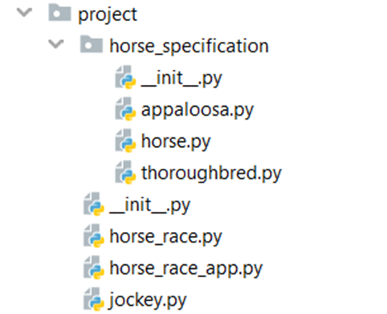

Problem description 

Python OOP Exam - Horse Racings

Horse racing is a very popular sport around the world. Today you will be in charge of arranging a horse racing app.
You will be provided with a skeleton that includes all the folders and files that you will need.
Note: You are not allowed to change the folder and file structure and change their names!

Judge Upload
For the first 2 problems, create a zip file with the project folder and upload it to the judge system.
For the last problem, create a zip file with the test folder and upload it to the judge system.
You do not need to include in the zip file your venv, .idea, pycache, and __MACOSX (for Mac users), so you do not exceed the maximum allowed size of 16.00 KB.
Structure (Problem 1) and Functionality (Problem 2)
Our first task is to implement the structure and functionality of all the classes (properties, methods, inheritance, abstraction, etc.)
You are free to add additional attributes (instance attributes, class attributes, methods, dunder methods, etc.) to simplify your code and increase readability as long as it does not change the project's final result according to the requirements and the program works properly.
1. Class Jockey
In the jockey.py file, the class Jockey should be implemented.
Structure
The class should have the following attributes:
•	name: str
o	A string that represents the name of the jockey
o	If the name is an empty string or contains only white spaces, raise a ValueError with the message: "Name should contain at least one character!"

•	age: int
o	An integer that represents the age of the jockey
o	The jockey must be at least 18 years old; if not - raise a ValueError with the message "Jockeys must be at least 18 to participate in the race!"
•	horse: Horse
o	An instance of a Horse (child) class representing the horse taken by the jockey. When a jockey is created in the app, he/she has NOT been given a horse yet. 
o	The value should be set to None.
o	Keep in mind that one jockey can ride only one horse.
Methods
__init__(name: str, age: int)
In the __init__ method, all the needed attributes must be set.
2. Class Horse
In the file horse.py, the class Horse should be implemented. It is a base class for any horse breed, and it should not be able to be instantiated.
Structure
The class should have the following attributes:
•	name: str
o	A string that represents the name of the horse.
o	If the name is less than 4 symbols, raise a ValueError with the message "Horse name {value} is less than 4 symbols!"
•	speed: int
o	An integer representing the speed that the horse can achieve.
o	Keep in mind that each horse breed has a different maximum speed, which cannot be exceeded. If the given horse speed exceeds the maximum, raise a ValueError with the message: "Horse speed is too high!"
•	is_taken: bool
o	A Boolean that represents the state of the horse - taken or not. When a horse is created in the app, it is free to be given to any jockey.
o	It should be set to False.
o	Keep in mind that one horse can have only one rider.
Methods
__init__(name: str, speed: int)
In the __init__ method, all the needed attributes must be set.
train()
Each horse can be additionally trained during the race days. When a horse is trained, it increases its speed by a value depending on its type. During training, a horse cannot exceed its maximum speed (just set its speed to the maximum one without raising an error).
3. Class Appaloosa
In the appaloosa.py file, the class Appaloosa should be implemented. It is a horse breed. Each appaloosa horse can have a maximum speed of 120km/h.
Methods
__init__(name: str, speed: int)
In the __init__ method, all the needed attributes must be set.
train()
Each time an appaloosa horse is trained, it increases its speed by 2.
4. Class Thoroughbred
In the thoroughbred.py file, the class Thoroughbred should be implemented. It is a horse breed. Each thoroughbred horse can have a maximum speed of 140km/h.
Methods
__init__(name: str, speed: int)
In the __init__ method, all the needed attributes must be set.
train()
Each time a thoroughbred horse is trained, it increases its speed by 3.
5. Class HorseRace
In the horse_race.py file, the class HorseRace should be implemented. It will store the details for every race.
The class should have the following attributes:
•	race_type: str
o	The valid types are "Winter", "Spring", "Autumn", or "Summer"
o	If the race type is NOT one of the above-mentioned, raise a ValueError with the message: "Race type does not exist!"
•	jockeys: list
o	An empty list that will store all the jockeys (objects) who will take part in the race.
Methods
__init__(race_type: str)
In the __init__ method all the needed attributes must be set.
6. Class HorseRaceApp
In the horse_race_app.py file, the class HorseRaceApp should be implemented. It will contain all the functionality of the project.
Structure
The class should have the following attributes:
•	horses: list
o	An empty list that will contain all the horses (objects).
•	jockeys: list
o	An empty list that will contain all the jockeys (objects).
•	horse_races: list
o	An empty list that will contain all the horse races (objects).
Methods
__init__()
In the __init__ method all the needed attributes must be set.
add_horse(horse_type: str, horse_name: str, horse_speed: int)
The method creates a horse and adds it to the horses' list.
•	If the horse is successfully created and added, the method should return the message: "{horse_type} horse {horse_name} is added."
•	If a horse with the same name already exists, raise an Exception with the message "Horse {horse_name} has been already added!"
•	The valid types of horse breeds are "Appaloosa" and "Thoroughbred". All other types must be ignored.
add_jockey(jockey_name: str, age: int)
The method creates a jockey and adds it to the jockeys' list.
•	If the jockey is successfully created and added, the method should return the message "Jockey {jockey_name} is added."
•	If a jockey with the given name already exists, raise an Exception with the message "Jockey {jockey_name} has been already added!"
create_horse_race(race_type: str)
The method creates a race and adds it to the horse races' list.
•	When it is successfully created and added, the method returns the message "Race {race_type} is created."
•	A race of each of the 4 types can be created just once. If a race of the same type already exists, raise an Exception with the message "Race {race type} has been already created!"
add_horse_to_jockey(jockey_name: str, horse_type: str)
Sets the last horse added from the given horse type to the jockey with the given name (if they both exist).
•	If the jockey does NOT exist in the jockeys' list, raise an Exception with the message "Jockey {jockey_name} could not be found!"
•	If there is no available horse (all horses of that type are taken, or no horse of that type exists) of the given type in the horses' list, raise an Exception with the message "Horse breed {horse_type} could not be found!".
•	If there is an available horse (the horse is not taken), but the jockey already has a horse, return the message: "Jockey {jockey_name} already has a horse."
•	If the horse can be added to the jockey, take it, and set it to the jockey. Then, return the message: "Jockey {jockey_name} will ride the horse {horse_name}."

add_jockey_to_horse_race(race_type: str, jockey_name: str)
Adds a jockey (object) to the given horse race type (if they both exist). A jockey can only participate in a horse race if he has a horse.
•	If a horse race of that type does NOT exist in the list with horse races, raise an Exception with the message "Race {race_type} could not be found!"
•	If the jockey does NOT exist in the jockeys' list, raise an Exception with the message "Jockey {jockey_name} could not be found!"
•	If the jockey is on the jockeys' list, but he/she doesn't have a horse, raise an Exception with the message "Jockey {jockey_name} cannot race without a horse!"
•	If the jockey has already been added to the horse race, return the message "Jockey {jockey_name} has been already added to the {race_type} race."
•	If both the race type and the jockey exist and the jockey has a horse, add the jockey (object) to the given horse race and return the message: "Jockey {jockey_name} added to the {race_type} race."
start_horse_race(race_type: str): 
•	If the horse race does NOT exist, raise an Exception with the message "Race {race_type} could not be found!"
•	The participants in a horse race must be at least 2. Otherwise, raise an Exception with the message "Horse race {race_type} needs at least two participants!"
•	If the race can be started, you should choose the winner - he/she is the jockey who rode the horse with the highest speed. Note: there will NOT be two or more jockeys riding their horse at the same highest speed. In the end, return the message: 
"The winner of the {race_type} race, with a speed of {highest_speed}km/h is {jockey_name}! Winner's horse: {horse_name}."

_______________________________________________
Example

from project.horse_race_app import HorseRaceApp

horseRaceApp = HorseRaceApp()
print(horseRaceApp.add_horse("Appaloosa", "Spirit", 80))
print(horseRaceApp.add_horse("Thoroughbred", "Rocket", 110))
print(horseRaceApp.add_jockey("Peter", 19))
print(horseRaceApp.add_jockey("Mariya", 21))
print(horseRaceApp.create_horse_race("Summer"))
print(horseRaceApp.add_horse_to_jockey("Peter", "Appaloosa"))
print(horseRaceApp.add_horse_to_jockey("Peter", "Thoroughbred"))
print(horseRaceApp.add_horse_to_jockey("Mariya", "Thoroughbred"))
print(horseRaceApp.add_jockey_to_horse_race("Summer", "Mariya"))
print(horseRaceApp.add_jockey_to_horse_race("Summer", "Peter"))
print(horseRaceApp.add_jockey_to_horse_race("Summer", "Mariya"))
print(horseRaceApp.start_horse_race("Summer"))

_______________________________________________
Output

Appaloosa horse Spirit is added.
Thoroughbred horse Rocket is added.
Jockey Peter is added.
Jockey Mariya is added.
Race Summer is created.
Jockey Peter will ride the horse Spirit.
Jockey Peter already has a horse.
Jockey Mariya will ride the horse Rocket.
Jockey Mariya added to the Summer race.
Jockey Peter added to the Summer race.
Jockey Mariya has been already added to the Summer race.
The winner of the Summer race, with a speed of 110km/h is Mariya! Winner's horse: Rocket.

_______________________________________________

Problem 3. Unit Tests
You will be provided with another skeleton for this problem. Open the new skeleton as a new project and write tests for the Bookstore class. The class will have some methods, fields, and one constructor, all of them working properly. You are NOT ALLOWED to change any class. Cover the whole class with unit tests to make sure that the class is working as intended. Submit only the test folder.

_______________________________________________