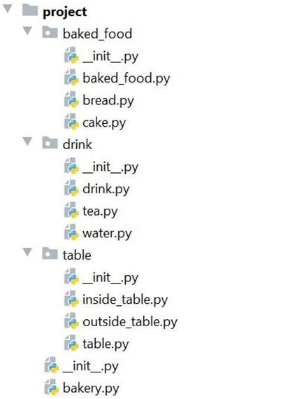

Problem description 

Python OOP Exam - 15.08.2021

As we all love baked delicacies, today you were chosen to build a simple bakery software system. This system must have support for baked foods, drinks, and tables in the bakery. The project will consist of classes, which manage the interaction between the baked foods, the drinks, and the tables.
You will be provided with a skeleton, which includes all the folders and files that you will need. 
Note: You are not allowed to change the folder and file structure and change their names!

Judge Upload
For the first 2 problems, create a zip file with the name project and upload it to the judge system
For the last problem, create a zip file with the name tests and upload it to the judge system
Structure (Problem 1) and Functionality (Problem 2)
Our first task is to implement the structure and functionality of all the classes (properties, methods, inheritance, etc.)
You are free to add additional attributes (instance attributes, class attributes, methods, dunder methods, etc.) to simplify your code and increase readability as long as it does not change the project's final result according to the requirements and the program works properly.
1.	BakedFood
In the baked_food.py file the class BakedFood should be implemented. It is a base class of any type of baked food, and it should not be able to be instantiated.
Structure
The class should have the following attributes:
•	name: string - passed upon initialization. 
o	If the name is an empty string or whitespace, raise a ValueError with the message: "Name cannot be empty string or white space!"
•	portion: float - passed upon initialization. It represents the size of the baked food in grams.
•	price: float - passed upon initialization.
o	If the price is less than or equal to 0, raise a ValueError with the message: "Price cannot be less than or equal to zero!"
Methods
__init__(name: str, portion: float, price: float)
The __init__ method should have a name, portion, and price. 
__repr__()
Override the repr method, so it returns a string with information about each food in the following format:
" - {baked_food_name}: {portion}g - {price}lv"
The portion size and the price should be formatted to the second decimal point.
2.	Bread
In the file bread.py, the class Bread should be implemented.
Structure
The class should inherit from the BakedFood class.
Methods
__init__(name: str, price: float)
Еach bread portion has an initial size of 200 grams.
3.	Cake
In the file cake.py, the class Cake should be implemented.
Structure
The class should inherit from the BakedFood class.
Methods
__init__(name: str, price: float)
Еach cake portion has an initial size of 245 grams.
4.	Drink
In the drink.py file, the class Drink should be implemented. It is a base class for any type of drink, and it should not be able to be instantiated.
Structure
The class should have the following attributes:
•	name: string - passed upon initialization. 
o	If the name is an empty string or whitespace, raise a ValueError with the message "Name cannot be empty string or white space!"
•	portion: float - passed upon initialization. It represents the size of the drink in milliliters.
o	If the portion is less than or equal to 0, raise a ValueError with the message "Portion cannot be less than or equal to zero!" 
•	price: float - passed upon initialization. 
•	brand: string - passed upon initialization. 
o	If the brand name is an empty string or whitespace, raise a ValueError with the message "Brand cannot be empty string or white space!"

Methods
__init__(name: str, portion: float, price: float, brand: str)
The __init__ method should have a name, a portion, a price, and a brand.  
__repr__()
Override the repr method, so it returns a string with the information about each drink in the following format:
" - {drink_name} {brand_name} - {portion}ml - {price}lv"
The portion size and the price should be formatted to the second decimal point.
5.	Tea
In the file tea.py, the class Tea should be implemented.
Structure
The class should inherit from the Drink class.
Methods
__init__(name: str, portion: float, brand: str)
Each tea costs exactly 2.50.
6.	Water
In the file water.py, the class Water should be implemented.
Structure
The class should inherit from the Drink class.
Methods
__init__(name: str, portion: float, brand: str)
Each water costs exactly 1.50.
7.	Table
In the table.py file, the class Table should be implemented. It is a base class for every type of table and should not be able to be instantiated.
Structure
The class should have the following attributes:
•	table_number: int - passed upon initialization.
•	capacity: int - passed upon initialization. It represents the table's seat capacity.
o	If it is less than or equal to zero, raise a ValueError with the message "Capacity has to be greater than 0!"
•	food_orders: an empty list that will contain every food order made from the table.
•	drink_orders: an empty list that will contain every drink order made from the table.
•	number_of_people: int - the count of people who sit at the table. 0 by default.
•	is_reserved: Bool - False by default. Returns True if the table is reserved.

Methods
__init__(table_number: int, capacity: int)
The __init__ method should have a table_number, a capacity, food_orders, drink_orders, number_of_people, and is_reserved.  
reserve(number_of_people: int)
Reserves the table with the count of people given.
order_food(baked_food: BakedFood)
Orders the provided food.
order_drink(drink: Drink)
Orders the provided drink.
get_bill()
Returns the bill for all the ordered drinks and food.
clear()
Removes all the ordered drinks and food and finally frees the seats at the table.
free_table_info()
Only if the table is free, returns a string in the following format:
"Table: {table_number}"
"Type: {table_type}"
"Capacity: {table_capacity}"
8.	InsideTable
In the file inside_table.py, the class InsideTable should be implemented.
Structure
The class should inherit from the Table class.
Methods
__init__(table_number: int, capacity: int)
The inside table's number could only be between 1 and 50 inclusive. Otherwise, raise a ValueError with the message "Inside table's number must be between 1 and 50 inclusive!".
9.	OutsideTable
In the file outside_table.py, the class OutsideTable should be implemented.
Structure
The class should inherit from the Table class.
Methods
__init__(table_number: int, capacity: int)
The outside table's number could only be between 51 and 100 inclusive. Otherwise, raise a ValueError with the message "Outside table's number must be between 51 and 100 inclusive!".
10.	Bakery
In the file bakery.py, the class Bakery should be implemented.
Structure
The class should have the following attributes:
•	name: str - passed upon initialization.
o	If the name is an empty string or whitespace, raise a ValueError with a message "Name cannot be empty string or white space!"
•	food_menu: an empty list that will contain every type of food in the bakery's menu.
•	drinks_menu: an empty list that will contain every type of drink in the bakery's menu. 
•	tables_repository: an empty list that will contain every table at the bakery.
•	total_income - the total income from all the completed bills. 0 by default.

Methods
__init__(name: str)
The __init__ method should have a name, a food_menu, drinks_menu, tables_repository, and total_income.
add_food (food_type: str, name: str, price: float)
Creates a food with the correct type and adds it to the menu. The possible types of food are "Bread" and "Cake". If the food is created and added successfully, returns:
"Added {baked_food_name} ({baked_food_type}) to the food menu"
If a baked food with the given name already exists in the food menu, raise an Exception with message "{food_type} {name} is already in the menu!"
add_drink (drink_type: str, name: str, portion: float, brand:str)
Creates a drink with the correct type and adds it to the menu. The possible types of drinks are "Tea" and "Water".  If the drink is created and added successfully, returns:
"Added {drink_name} ({drink_brand}) to the drink menu"
If a drink with the given name already exists in the drink menu, raise Exception with the message "{drink_type} {name} is already in the menu!"
add_table (table_type: str, table_number: int, capacity: int)
Creates a table with the correct type, adds it to the table repository. The possible types of tables are "InsideTable" and "OutsideTable".  If the table is created and added successfully, returns:
"Added table number {table_number} in the bakery"
If a table with the given number already exists in the table repository, raise Exception with the message "Table {table_number} is already in the bakery!"
reserve_table (number_of_people: int)
Finds the first possible table which is not reserved, and its capacity is enough for the number of people provided. Then reserves the table and returns:
"Table {table_number} has been reserved for {number_of_people} people"
Otherwise, returns:
"No available table for {number_of_people} people"
order_food (table_number: int, food_name1: str, food_name2: str …)
The order_food method will receive a table's number and a different number of strings with food's names.
Finds the table with that number. If there is no such table returns:
"Could not find table {table_number}"
Otherwise, adds the food which could be ordered (are in the menu) in the table's orders, returns the information about the ordered food and the food that is not in the menu in the format:
"Table {table_number} ordered:
 - {baked_food_name1}: {portion1}g - {price1}lv
 - {baked_food_name2}: {portion2}g - {price2}lv
…
 - {baked_food_nameN}: {portionN}g - {priceN}lv
{bakery_name} does not have in the menu:
{food_name_not_in_the_menu1}
{food_name_not_in_the_menu2}
…
{food_name_not_in_the_menuN}"
order_drink (table_number: int, drinks_name1: str, drink_name2: str …)
The order_drink method will receive a table's number and different number of strings with drink's names.
Finds the table with that number. If there is no such table, it returns:
"Could not find table {table_number}"
Otherwise, adds the drinks which could be ordered (are in the menu) in the table's orders, returns orders of the drinks which are in the menu and the ones that are not:
"Table {table_number} ordered:
 - {drink_name1} {brand_name1} - {portion1}ml - {price1}lv
 - {drink_name2} {brand_name2} - {portion2}ml - {price2}lv
…
 - {drink_nameN} {brand_nameN} - {portionN}ml - {priceN}lv 
{bakery_name} does not have in the menu:
{drink_name_not_in_the_menu1}
{drink_name_not_in_the_menu2}
…
{drink_name_not_in_the_menuN}"
leave_table (table_number: int)
Finds the table with the same table number, gets the bill for that table and clears it. Finally returns:
"Table: {table_number}"
"Bill: {table_bill}"
The bill price should be formatted to the second decimal point.
get_free_tables_info()
For each free table, returns the table info. Each table info should start on a new row.
get_total_income()
Returns the total income in the format, formatted to the second decimal point:
"Total income: {income}lv"

_______________________________________________

Task 3: Unit Tests
You will be provided with another skeleton for this problem. Open the new skeleton as a new project and write tests for the ShoppingCart class. The class will have some methods, fields, and one constructor, all of them working properly. You are NOT ALLOWED to change any class. Cover the whole class with unit tests to make sure that the class is working as intended. Submit only the test folder.

_______________________________________________