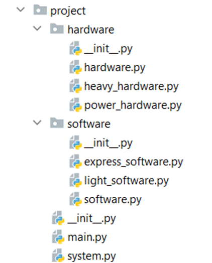

Problem description

    Python OOP Exam - System Split

You have been given the task to gather statistics about The System. The System is a network of components connected to build something which functions logically, but you don't need to know that. You need to build a program that processes statistics about The System.
You will be provided with a skeleton that includes all the folders and files that you will need. 
Note: You are not allowed to change the folder and file structure and change their names!

Judge Upload
For the first 2 problems, create a zip file with the name project and upload it to the judge system
For the last problem, create a zip file with the name tests and upload it to the judge system
Structure (Problem 1) and Functionality (Problem 2)
Our first task is to implement the structure and functionality of all the classes (properties, methods, inheritance, etc.)
Note: Feel free to add any additional methods that might help you.
1.	Class Software
In the file software.py implement the Software class:
Structure
The class should have the following attributes:
•	name: str
•	software_type: str
•	capacity_consumption: int
•	memory_consumption: int
Methods
__init__(name: str, software_type: str, capacity_consumption: int, memory_consumption: int)
Set the attributes to the provided values
2.	Class LightSoftware
In the file light_software.py implement the LightSoftware class:
•	The light software is a type of software, and its type is "Light"
•	It has 50% more capacity consumption than the given value. The result should be rounded down to the nearest integer.
•	It has 50% less memory consumption than the given value. The result should be rounded down to the nearest integer.
3.	Class ExpressSoftware
In the file express_software.py implement the ExpressSoftware class:
•	The express software is a type of software, and its type is "Express"
•	It has twice more memory consumption than the given value
4.	Class Hardware
In the file hardware.py implement the Hardware class:
Structure
The class should have the following attributes:
•	name: str
•	hardware_type: str
•	capacity: int
•	memory: int
•	software_components: list - an empty list that will contain all software's components installed on that hardware
Methods
__init__(name: str, hardware_type: str, capacity: int, memory: int)
Set the attributes to the provided values
install(software: Software)
If there is enough capacity and memory, add the software object to the software components. Otherwise, raise Exception with the message "Software cannot be installed"
uninstall(software: Software)
Remove the software object from the software components
5.	Class HeavyHardware
In the file heavy_hardware.py implement the HeavyHardware class:
•	Heavy hardware is a type of hardware, and its type is "Heavy"
•	It has twice more capacity than the given value
•	Its memory is 75% from the given value. The result should be rounded down to the nearest integer.
6.	Class PowerHardware
In the file power_hardware.py implement the PowerHardware class:
•	The power hardware is a type of hardware, and its type is "Power"
•	Its capacity is 25% of the given value. The result should be rounded down to the nearest integer.
•	It has 75% more memory than the given value. The result should be rounded down to the nearest integer.
7.	Class System
The System class is where all the logic of the task will be implemented
The class should have the following attributes:
•	_hardware - an empty list that will be storing all the hardware components
•	_software - an empty list that will be storing all the software components
Methods
All described methods below should be static!
register_power_hardware(name: str, capacity: int, memory: int)
Create a PowerHardware instance and add it to the hardware list
register_heavy_hardware(name: str, capacity: int, memory: int)
Create a HeavyHardware instance and add it to the hardware list
register_express_software(hardware_name: str, name: str, capacity_consumption: int, memory_consumption: int)
•	If the hardware with the given name does NOT exist, return the message "Hardware does not exist"
•	Otherwise, create an express software, install it on the hardware, and add it to the software list
•	If the installation is not possible, raise Exception with the message "Software cannot be installed"
register_light_software(hardware_name: str, name: str, capacity_consumption: int, memory_consumption: int)
•	If the hardware with the given name does NOT exist, return a message "Hardware does not exist"
•	Otherwise, create a light software instance, install it on the hardware, and add it to the software list
•	If the installation is not possible, raise Exception with the message "Software cannot be installed"
release_software_component(hardware_name: str, software_name: str)
•	If both components exist on the system, uninstall the software from the given hardware, and remove it from the software list
•	Otherwise, return a message "Some of the components do not exist"
analyze()
Return the following information (as a string) for the total memory and capacity used (calculated for all hardware components in the system):
"System Analysis
Hardware Components: {number_of_hardware_components}
Software Components: {number_of_software_components}
Total Operational Memory: {total memory consumption for all registered software components} / {total memory for all registered hardware components}
Total Capacity Taken: {total capacity consumption for all registered software components} / {total capacity of all registered hardware components}"
system_split()
Return the following information (as a string) for each hardware component:
"Hardware Component - {component name}
Express Software Components: {number of the installed express software components}
Light Software Components: {number of the installed light software components}
Memory Usage: {total memory used of all installed software components} / {total memory of the hardware}
Capacity Usage: {total capacity used of all installed software components } / {total capacity of the hardware}
Type: {hardware_type}
Software Components: {names of all software components separated by ', '} (or 'None' if no software components)"
Examples
In the main.py file we have created a zero test, so you can test your code

_______________________________________________
Example

System.register_power_hardware("HDD", 200, 200)
System.register_heavy_hardware("SSD", 400, 400)
print(System.analyze())
System.register_light_software("HDD", "Test", 0, 10)
System.register_express_software("HDD", "Test3", 50, 100)
System.register_light_software("SSD", "Windows", 20, 50)
System.register_express_software("SSD", "Linux", 50, 100)
System.register_light_software("SSD", "Unix", 20, 50)
print(System.analyze())
System.release_software_component("SSD", "Linux")
print(System.system_split())

_______________________________________________
Output

System Analysis
Hardware Components: 2
Software Components: 0
Total Operational Memory: 0 / 650
Total Capacity Taken: 0 / 850
System Analysis
Hardware Components: 2
Software Components: 5
Total Operational Memory: 455 / 650
Total Capacity Taken: 160 / 850
Hardware Component - HDD
Express Software Components: 1
Light Software Components: 1
Memory Usage: 205 / 350
Capacity Usage: 50 / 50
Type: Power
Software Components: Test, Test3
Hardware Component - SSD
Express Software Components: 0
Light Software Components: 2
Memory Usage: 50 / 300
Capacity Usage: 60 / 800
Type: Heavy
Software Components: Windows, Unix

_______________________________________________

Unit Testing (Problem 3)
You will be provided with another skeleton for this problem. You should write tests for the PaintFactory class. It will have some properties, methods, and a constructor, all of them working properly. You are NOT ALLOWED to change the class. Cover the whole class with unit tests to make sure that the class is working as intended. Submit only the test folder.

_______________________________________________