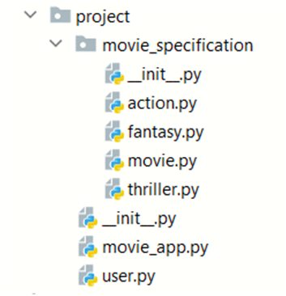

Problem description 
Python OOP Exam - Movie App

You are given a task to create a basic class application.
You will be provided with a skeleton that includes all the folders and files you will need.
Note: You are not allowed to change the folder and file structure and change their names!

Judge Upload
For the first 2 problems, create a zip file with the project folder and upload it to the judge system. 
For the last problem, create a zip file with the test folder and upload it to the judge system.
You do not need to include in the zip file your venv, .idea, pycache, and __MACOSX (for Mac users), so you do not exceed the maximum allowed size of 16.00 KB.
Structure (Problem 1) and Functionality (Problem 2)
Our first task is to implement the structure and functionality of all the classes (properties, methods, inheritance, etc.)
You are free to add additional attributes (instance attributes, class attributes, methods, dunder methods, etc.) to simplify your code and increase readability as long as it does not change the project's result according to the requirements and the program works properly.
1.	Class User
In the user.py file, the class User should be implemented.
Structure
The class should have the following attributes:
•	username: str
o	A string that represents the username of the user
o	If the name is an empty string, raise a ValueError with the message "Invalid username!"
•	age: int
o	An integer that represents the age of the user
o	If the value of age is under 6, raise a ValueError with the message "Users under the age of 6 are not allowed!"
•	movies_liked: list
o	An empty list that will contain all movies (objects) liked by the user
•	movies_owned: list
o	An empty list that will contain all movies (objects) owned by the user
Methods
__init__(username: str, age: int)
In the __init__ method all the needed attributes must be set.
__str__()
Override the __str__() to return the string:
"Username: {username}, Age: {age}"
"Liked movies:"
"{details() of each movie liked by the user, on separate lines}"
•	If no liked movies: "No movies liked."
"Owned movies:"
"{details() of every movie owned by the user}"
•	If no owned movies: "No movies owned."
2.	Class Movie
In the movie.py file, the class Movie should be implemented. It is a base class for any genre of movie, and it should not be able to be instantiated.
Structure
The class should have the following attributes:
•	title: str
o	A string that represents the title of the movie
o	If the title is an empty string, raise a ValueError with the message "The title cannot be empty string!"
•	year: int
o	An integer that represents the year when the movie was released
o	If the year is under 1888, raise ValueError with the message "Movies weren't made before 1888!"
•	owner: User
o	A user object that represents the one who made the movie
o	If the owner is NOT an object of type User, raise a ValueError with the message "The owner must be an object of type User!"
•	age_restriction: int
o	The movie is unsuitable for people under the given age. The age restriction value depends on the movie genre. 
•	likes: int
o	It represents the number of likes of the movie
o	It should be set to 0 by default
Methods
__init__(title: str, year: int, owner: object, age_restriction: int)
In the __init__ method all the needed attributes must be set.
details()
It returns a string with information about the movie by its type.
3.	Class Fantasy
In the fantasy.py file, the class Fantasy should be implemented.
If no age restriction is given, it should be set to 6 (years).
If the age restriction given is less than 6, raise a ValueError with the message "Fantasy movies must be restricted for audience under 6 years!"
Methods
__init__(title: str, year: int, owner: object, age_restriction: int)
In the __init__ method all the needed attributes must be set.
details()
It should return a string on one line in the format:
"Fantasy - Title:{movie_title}, Year:{movie_year}, Age restriction:{movie_age_restriction}, Likes:{movie_likes}, Owned by:{movie_owner_username}"
4.	Class Action
In the action.py file, the class Action should be implemented. 
If no age restriction is given, it should be set to 12 (years).
If the age restriction given is less than 12, raise a ValueError with the message "Action movies must be restricted for audience under 12 years!"
Methods
__init__(title: str, year: int, owner: object, age_restriction: int)
In the __init__ method all the needed attributes must be set.
details()
It should return a string on one line in the format:
"Action - Title:{movie_title}, Year:{movie_year}, Age restriction:{movie_age_restriction}, Likes:{movie_likes}, Owned by:{movie_owner_username}"
5.	Class Thriller
In the thriller.py file, the class Thriller should be implemented.
If no age restriction is given, it should be set to 16 (years).
If the age restriction is less than 16, raise a ValueError with the message "Thriller movies must be restricted for audience under 16 years!"
Methods
__init__(title: str, year: int, owner: object, age_restriction: int)
In the __init__ method all the needed attributes must be set.
details():
It should return a string on one line in format:
"Thriller - Title:{movie_title}, Year:{movie_year}, Age restriction:{movie_age_restriction}, Likes:{movie_likes}, Owned by:{movie_owner_username}"
6.	Class MovieApp
In the movie_app.py file, the class MovieApp should be implemented. It will contain all the functionality of the project.
Structure
The class should have the following attributes:
•	movies_collection: list
o	An empty list that will contain all the movies (objects)
•	users_collection: list
o	An empty list that will contain all the users (objects)
Methods
__init__()
In the __init__ method all the needed attributes must be set.
register_user(username: str, age: int)
Creates an instance of the User class with the given username and age, and:
•	If the user (object) is not in the users_collection list, add him/her and return the message "{username} registered successfully."
•	If a user with the same username is already registered, raise an Exception with the message "User already exists!"
upload_movie(username: str, movie: Movie)
Only the owner of the given movie can upload it. 
The method adds the movie to the user's movies_owned list as well as the movies_collection list:
•	If the addition is successful, returns the message: "{username} successfully added {movie_title} movie."
•	If the user with the username provided is not registered in the app, raise an Exception with the message: "This user does not exist!"
•	If the user exists, but he/she is not the owner of the given movie, raise an Exception with the message: "{username_given} is not the owner of the movie {movie_title}!"
•	If the movie object is already uploaded, raise an Exception with the message: "Movie already added to the collection!"
edit_movie(username: str, movie: Movie, **kwargs)
Only the owner of the movie given can edit it. You will always be given usernames of registered users.
In this method, as kwargs you can receive one or more key-value pairs. Each key will be a movie's attribute name ("title", "year", or "age_restriction"), and the value will be the new value for that attribute. You will not receive anything different from the keys mentioned above.
The method edits the movie attributes with the given values and returns the message "{username} successfully edited {movie_title} movie."
•	If the movie is not uploaded, raise an Exception with the message "The movie {movie_title} is not uploaded!"
•	If the user does not own that movie, raise an Exception with the message "{username given} is not the owner of the movie {movie_title}!"
delete_movie(username: str, movie: Movie)
Only the owner of the movie given can delete it. You will always be given usernames of registered users.
This method deletes the movie given in both movies_collection and user's movies_owned lists. Then, it should return the message "{username} successfully deleted {movie_title} movie."
•	If the movie is not uploaded, raise an Exception with the message "The movie {movie_title} is not uploaded!"
•	If the user does not own that movie, raise Exception with the message "{username given} is not the owner of the movie {movie_title}!"
like_movie(username: str, movie: Movie)
Owners cannot like their own movies. You will always be given usernames of registered users and uploaded movies.
This method increases the value of the movie attribute likes by 1 and adds the movie to the user's list movies_liked. Then, it returns the message "{username} liked {movie_title} movie."
•	If the user is also the owner, raise an Exception with the message "{username} is the owner of the movie {movie_title}!"
•	If the user already liked that movie, raise an Exception with the message "{username} already liked the movie {movie_title}!"
dislike_movie(username: str, movie: Movie)
Only the user who has liked the movie can dislike it. You will always be given usernames of registered users and uploaded movies.
This method decreases the value of the movie attribute likes by 1 and removes that movie from the user's movies_liked list. Then, it returns the message "{username} disliked {movie_title} movie."
•	If the user didn't like that movie in the first place, raise an Exception with the message "{username} has not liked the movie {movie_title}!"
display_movies()
This method sorts all movies uploaded by the year in descending order. If there are two or more movies of the same year, sort them by title:
•	It should return the details() for each movie on separate lines in the format.
•	If there are no movies uploaded, it returns: "No movies found."
__str__()
This method should return a string on 2 lines for all users' usernames and movies titles in the following format:
"All users: {all users' usernames separated by a comma and a space ", "}"
•	If no users: "All users: No users."
"All movies: {all movies' titles separated by a comma and a space ", "}"
•	If no movies: "All movies: No movies."

_______________________________________________
Example

from project.movie_app import MovieApp
from project.movie_specification.fantasy import Fantasy
from project.movie_specification.action import Action

movie_app = MovieApp()
print(movie_app.register_user('Martin', 24))
user = movie_app.users_collection[0]
movie = Action('Die Hard', 1988, user, 18)
print(movie_app.upload_movie('Martin', movie))
print(movie_app.movies_collection[0].title)
print(movie_app.register_user('Alexandra', 25))
user2 = movie_app.users_collection[1]
movie2 = Action('Free Guy', 2021, user2, 16)
print(movie_app.upload_movie('Alexandra', movie2))
print(movie_app.edit_movie('Alexandra', movie2, title="Free Guy 2"))
print(movie_app.like_movie('Martin', movie2))
print(movie_app.like_movie('Alexandra', movie))
print(movie_app.dislike_movie('Martin', movie2))
print(movie_app.like_movie('Martin', movie2))
print(movie_app.delete_movie('Alexandra', movie2))
movie2 = Fantasy('The Lord of the Rings', 2003, user2, 14)
print(movie_app.upload_movie('Alexandra', movie2))
print(movie_app.display_movies())
print(movie_app)

_______________________________________________
Output

Martin registered successfully.
Martin successfully added Die Hard movie.
Die Hard
Alexandra registered successfully.
Alexandra successfully added Free Guy movie.
Alexandra successfully edited Free Guy 2 movie.
Martin liked Free Guy 2 movie.
Alexandra liked Die Hard movie.
Martin disliked Free Guy 2 movie.
Martin liked Free Guy 2 movie.
Alexandra successfully deleted Free Guy 2 movie.
Alexandra successfully added The Lord of the Rings movie.
Fantasy - Title:The Lord of the Rings, Year:2003, Age restriction:14, Likes:0, Owned by:Alexandra
Action - Title:Die Hard, Year:1988, Age restriction:18, Likes:1, Owned by:Martin
All users: Martin, Alexandra
All movies: Die Hard, The Lord of the Rings

_______________________________________________

Task 3: Unit Tests
You will be provided with another skeleton for this problem. Open the new skeleton as a new project and write tests for the ToyStore class. The class will have some methods, fields, and one constructor, all of them working properly. You are NOT ALLOWED to change any class. Cover the whole class with unit tests to make sure that the class is working as intended. Submit only the test folder.

_______________________________________________