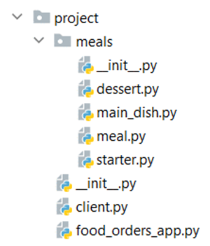

Problem description 

 Python OOP Exam - Food Orders App

You are given a task to create a basic class application.
You will be provided with a skeleton that includes all the folders and files you will need.
Note: You are not allowed to change the folder and file structure and change their names!

Judge Upload
For the first 2 problems, create a zip file with the project folder and upload it to the judge system. 
For the last problem, create a zip file with the test folder and upload it to the judge system.
You do not need to include in the zip file your venv, .idea, pycache, and __MACOSX (for Mac users), so you do not exceed the maximum allowed size of 16.00 KB.
Structure (Problem 1) and Functionality (Problem 2)
Our first task is to implement the structure and functionality of the classes (properties, methods, inheritance, etc.)
You are free to add additional attributes (instance attributes, class attributes, methods, dunder methods, etc.) to simplify your code and increase readability as long as it does not change the project's result according to the requirements and the program works properly.
1.	Class Client
In the client.py file, the class Client should be implemented.
Structure
The class should have the following attributes:
•	phone_number: str
o	A string that represents the phone number of the client
o	It must start with "0" (zero), must be 10 characters long, and must contain only numbers. 
Otherwise, raise a ValueError with the message "Invalid phone number!"
•	shopping_cart: list
o	An empty list that will contain all meals (objects) added by the client
•	bill: float
o	It represents the total amount of money for all meals that the client has added to his shopping cart
o	It should be set to 0.0 initially
Methods
__init__(phone_number: str)
In the __init__ method all the needed attributes must be set.
2.	Class Meal
In the meal.py file, the class Meal should be implemented. It is a base class for any type of meal, and it should not be able to be instantiated.
Structure
The class should have the following attributes:
•	name: str
o	A string that represents the name of the meal
o	If the name is an empty string, raise a ValueError with the message "Name cannot be an empty string!"
•	price: float
o	A float number that represents the price per one piece of a meal
o	If the price is less than or equal to 0.0, raise a ValueError with the message "Invalid price!"
•	quantity: int
o	An integer that represents the quantity available (to be ordered) for that meal
Methods
__init__(name: str, price: float, quantity: int)
In the __init__ method all the needed attributes must be set.
details()
It returns a string with information about the meal.
3.	Class Starter
In the starter.py file, the class Starter should be implemented. It is a type of meal.
If no quantity is given, it should be set to 60.
Methods
__init__(name: str, price: float, quantity: int)
In the __init__ method all the needed attributes must be set.
details()
It should return a string on one line in the format shown below. The price should be formatted to the second decimal place:
"Starter {name}: {price}lv/piece"
4.	Class MainDish
In the main_dish.py file, the class MainDish should be implemented. It is a type of meal.
If no quantity is given, it should be set to 50.
Methods
__init__(name: str, price: float, quantity: int)
In the __init__ method all the needed attributes must be set.
details()
It should return a string on one line in the format shown below. The price should be formatted to the second decimal place:
"Main Dish {name}: {price}lv/piece"
5. Class Dessert
In the dessert.py file, the class Dessert should be implemented. It is a type of meal.
If no quantity is given, it should be set to 30.
Methods
__init__(name: str, price: float, quantity: int)
In the __init__ method all the needed attributes must be set.
details()
It should return a string on one line in the format shown below. The price should be formatted to the second decimal place:
"Dessert {name}: {price}lv/piece"
6. Class FoodOrdersApp
In the food_orders_app.py file, the class FoodOrdersApp should be implemented. It will contain all the functionality of the project.
Structure
The class should have the following attributes:
•	menu: list
o	An empty list that will contain all the meals (objects)
•	clients_list: list
o	An empty list that will contain all the clients (objects)
Methods
__init__()
In the __init__ method all the needed attributes must be set.
register_client(client_phone_number: str)
•	Creates a client (object) and adds it to the client list and returns the message "Client {phone_number} registered successfully."
•	If a client with the same phone number is already registered, raise an Exception with the message "The client has already been registered!"
add_meals_to_menu(*meals: Meal)
•	This method adds all the meals (objects) given to the menu list.
•	If one or more of the provided objects are NOT meals (not a "Starter", a "MainDish", or a "Dessert") ignore them and keep adding only the meals.
•	Note: you will always be given meals with different names.
show_menu()
•	It should return the details() for each meal on the menu on separate lines
•	If there are less than 5 meals on the menu, raise an Exception with the message "The menu is not ready!"
add_meals_to_shopping_cart(client_phone_number: str, **meal_names_and_quantities)
The client attempts to order food. All clients can add any meal that is on the menu if there is enough quantity. You will be given a dictionary with the meal names as keys and the quantity the client wants for each meal as values.
•	Adds the meals (objects) to the client's shopping cart. It also increases the client's bill with the price for the concrete meal by the quantity added and decreases the meal quantity on the menu. Returns the message "Client {client_phone_number} successfully ordered {meal_names} for {client_bill}lv."
o	The meal names refer to all meal names on the client's shopping cart. They should be separated by a comma and a space ", ".
o	The bill is the total amount of money for all meals on the client's shopping cart. It should be formatted to the second decimal point.
•	First, the client can only add meals to his/ her cart when the menu is ready. If there are less than 5 meals on the menu, raise an Exception with the message "The menu is not ready!"
•	If the client with the provided phone number is not registered in the app, he/she should be registered automatically with the provided phone number, then he/she can continue with the order.
•	If a meal with the given name is not on the menu, raise an Exception with the message: "{meal_name} is not on the menu!"
o	If the exception is raised, the client could NOT make the order at all (none of the meals should be added to the client's shopping cart, and the bill should not be increased).
•	If there isn't enough quantity of a meal to be added to the cart, you must raise an Exception with the following message: "Not enough quantity of {meal_type}: {meal_name}!"
o	The meal types are "Starter", "MainDish" and "Dessert"
o	If the exception is raised, the client could NOT make the order at all (none of the meals should be added to the client's shopping cart, and the bill should not be increased).
cancel_order(client_phone_number: str)
You will always be given an existing client phone number.
•	The client decides to cancel his/ her order. This method removes all the meals that the client has added to his/her shopping cart and resets the bill to 0 and returns the message: "Client {phone_number} successfully canceled his order.". Keep in mind that you should update the quantity of the meals on the menu list after the cancellation.
•	If there are no meals on the client's shopping cart, raise an Exception with the message "There are no ordered meals!"
finish_order(client_phone_number: str)
You will always be given an existing client phone number.
•	The client pays the bill and receives the ordered meals. This method removes all the meals that the client has added to his/ her cart and resets the bill to 0. Then, it returns the following message: "Receipt #{receipt_id} with total amount of {total_paid_money} was successfully paid for {client_phone_number}."
o	The receipt_id is automatically generated each time a bill is paid (regardless of the client). It starts from 1 and increases by 1 with each new paid bill.
o	The total paid money should be formatted to the second decimal place.
•	If there are no meals on the client's shopping cart, raise an Exception with the message "There are no ordered meals!"
__str__()
This method should return a string with the following information:
"Food Orders App has {number_of_listed_meals} meals on the menu and {number_of_clients} clients."
•	Note: The number of listed meals is the number of added-to-the-menu meals (objects), NOT their total quantity.

_______________________________________________
Example

from project.food_orders_app import FoodOrdersApp
from project.meals.starter import Starter
from project.meals.dessert import Dessert
from project.meals.main_dish import MainDish

food_orders_app = FoodOrdersApp()
print(food_orders_app.register_client("0899999999"))
french_toast = Starter("French toast", 6.50, 5)
hummus_and_avocado_sandwich = Starter("Hummus and Avocado Sandwich", 7.90)
tortilla_with_beef_and_pork = MainDish("Tortilla with Beef and Pork", 12.50, 12)
risotto_with_wild_mushrooms = MainDish("Risotto with Wild Mushrooms", 15)
chocolate_cake_with_mascarpone = Dessert("Chocolate Cake with Mascarpone", 4.60, 17)
chocolate_and_violets = Dessert("Chocolate and Violets", 5.20)
print(food_orders_app.add_meals_to_menu(
    french_toast, hummus_and_avocado_sandwich,
    tortilla_with_beef_and_pork,
    risotto_with_wild_mushrooms,
    chocolate_cake_with_mascarpone,
    chocolate_and_violets))
print(food_orders_app.show_menu())
food = {"Hummus and Avocado Sandwich": 5,
        "Risotto with Wild Mushrooms": 1,
        "Chocolate and Violets": 4}
print(food_orders_app.add_meals_to_shopping_cart('0899999999', **food))
additional_food = {"Risotto with Wild Mushrooms": 2,
                   "Tortilla with Beef and Pork": 2}
print(food_orders_app.add_meals_to_shopping_cart('0899999999', **additional_food))
print(food_orders_app.finish_order("0899999999"))
print(food_orders_app)

_______________________________________________
Output

Client 0899999999 registered successfully.
None
Starter French toast: 6.50lv/piece
Starter Hummus and Avocado Sandwich: 7.90lv/piece
Main Dish Tortilla with Beef and Pork: 12.50lv/piece
Main Dish Risotto with Wild Mushrooms: 15.00lv/piece
Dessert Chocolate Cake with Mascarpone: 4.60lv/piece
Dessert Chocolate and Violets: 5.20lv/piece
Client 0899999999 successfully ordered Hummus and Avocado Sandwich, Risotto with Wild Mushrooms, Chocolate and Violets for 75.30lv.
Client 0899999999 successfully ordered Hummus and Avocado Sandwich, Risotto with Wild Mushrooms, Chocolate and Violets, Risotto with Wild Mushrooms, Tortilla with Beef and Pork for 130.30lv.
Receipt #1 with total amount of 130.30 was successfully paid for 0899999999.
Food Orders App has 6 meals on the menu and 1 clients.

_______________________________________________

Task 3: Unit Tests
You will be provided with another skeleton for this problem. Open the new skeleton as a new project and write tests for the ShoppingCart class. The class will have some methods, fields, and one constructor, all of them working properly. You are NOT ALLOWED to change any class. Cover the whole class with unit tests to make sure that the class is working as intended. Submit only the test folder.

_______________________________________________