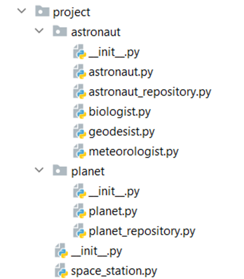

Problem description 

Python OOP Retake Exam – 23.08.2021

 

There is a space station, which navigates astronauts to collect items from foreign planets. The astronauts with different professional specialties have different survival capabilities in the open space according to their essential needs, like the need for oxygen. Your task is to send them on missions and collect items from the different planets.
You will be provided with a skeleton, which includes all the folders and files you will need. 
Note: You are not allowed to change the folder and file structure and change their names!

Judge Upload
For the first 2 problems, create a zip file with the name project and upload it to the judge system.
For the last problem, create a zip file with the name tests and upload it to the judge system.
Structure (Problem 1) and Functionality (Problem 2)
Our first task is to implement the structure and functionality of all the classes (properties, methods, inheritance, etc.)
You are free to add additional attributes (instance attributes, class attributes, methods, dunder methods, etc.) to simplify your code and increase readability as long as it does not change the project's final result according to the requirements and the program works properly.
1.	Astronaut
In the astronaut.py file, the class Astronaut should be implemented. It is a base class of any type of astronaut, and it should not be able to be instantiated.
Structure
The class should have the following attributes:
•	name: str
o	If the name is an empty string or whitespace, raise a ValueError with the message: "Astronaut name cannot be empty string or whitespace!"
•	оxygen: int
o	The oxygen of an astronaut in units
•	backpack: an empty list
o	In the backpack, each astronaut will collect items while on a mission
Methods
__init__(name: str, oxygen: int)
The __init__ method should have a name, a given amount of oxygen, and a backpack. 
breathe()
Each time an astronaut takes a breath, their oxygen decreases by 10 units. Note: some types of astronauts need more oxygen units while breathing.
increase_oxygen(amount: int)
Increases the oxygen with the given amount.
2.	Biologist
In the file biologist.py, the class Biologist should be implemented. The biologist is a type of astronaut. Each biologist has 70 initial units of oxygen, and each time they take a breath, their oxygen is decreased by 5 units.
3.	Geodesist
In the file geodesist.py, the class Geodesist should be implemented. The geodesist is a type of astronaut. Each geodesist has 50 initial units of oxygen.
4.	Meteorologist
In the file meteorologist.py, the class Meteorologist should be implemented. The meteorologist is a type of astronaut. Each meteorologist has 90 initial units of oxygen, and each time they take a breath, their oxygen is decreased by 15 units.
5.	AstronautRepository
In the astronaut_repository.py file, the class AstronautRepository should be implemented. It is a repository for the astronauts that are on the Space Station.
Structure
The class should have the following attributes:
•	astronauts: an empty list of astronauts
Methods
__init__()
The __init__ method should have astronauts. 
add(astronaut: Astronaut)
•	Adds an astronaut.
remove(astronaut: Astronaut)
•	Removes an astronaut from the collection.
find_by_name(name: str)
•	Returns an astronaut with that name if he/ she exists.
6.	Planet
In the planet.py file, the class Planet should be implemented. It is an implementation for a planet, and it holds information about the items that can be found on its surface.
Structure
The class should have the following attributes:
•	name: str
o	If the name is an empty string or whitespace, raise a ValueError with the message: "Planet name cannot be empty string or whitespace!"
•	items: an empty list of strings holding each item that could be found on that planet
Methods
__init__(name: str)
The __init__() method should have a name and items.
7.	PlanetRepository
In the planet_repository.py file, the class PlanetRepository should be implemented. It is a repository for planets that await to be explored.
Structure
The class should have the following attributes:
•	planets: an empty list of planets
Methods 
__init__()
The __init__ method should have an empty list of planets. 
add(planet: Planet)
•	Adds a planet for exploration.
remove(planet: Planet)
•	Removes a planet from the collection. 
find_by_name(name: str)
•	Returns a planet with that name if it exists.
8.	SpaceStation
In the space_station.py file, the class SpaceStation should be implemented. 
Structure
The class should have the following attributes:
•	planet_repository: a new repository created for each space station
•	astronaut_repository: a new repository created for each space station
Methods 
__init__()
The __init__ method should have a planet_repository and an astronaut_repository. 
add_astronaut(astronaut_type: str, name: str) 
•	Creates an astronaut with the given name of the given type, adds them to the repository and returns the following message: "Successfully added {astronaut_type}: {astronaut_name}."
•	If an astronaut with that name is already in the repository returns: "{astronaut_name} is already added."
•	The valid astronaut types are "Biologist", "Geodesist" and "Meteorologist". If the astronaut type is invalid, raise an Exception with the message: "Astronaut type is not valid!"
add_planet(name: str, items: str)
•	Creates a planet with the provided name and items (single string with words, separated by ", "), adds it to the repository, and returns the following message: "Successfully added Planet: {planet_name}."
•	If a planet with that name is already in the repository returns: "{planet_name} is already added."
retire_astronaut(name: str)
•	Retires the astronaut from the space station by removing them from the repository and returns the following message: "Astronaut {astronaut_name} was retired!"
•	 If an astronaut with that name doesn't exist, raise Exception with the following message: "Astronaut {astronaut_name} doesn't exist!"
recharge_oxygen()
•	The method increases the oxygen of each astronaut by 10 units. There is no capacity limit.
send_on_mission(planet_name: str)
•	If the planet does not exist, raise an Exception with the following message: "Invalid planet name!"
•	You should start by choosing the astronauts that are most suitable for the mission:
o	You should pick up to 5 astronauts with the highest amount of oxygen among the ones with oxygen above 30 units.
o	If you don't have any suitable astronauts, raise an Exception with the following message: "You need at least one astronaut to explore the planet!"
•	The astronauts start going out in open space one by one, sorted in descending order by the amount of oxygen they have:
o	An astronaut lands on a planet and starts collecting its items one by one starting from the last one in the collection. Each time he/she finds an item he/she takes a breath.
o	If an astronaut runs out of oxygen, he/ she should return to the space station, and the next astronaut starts exploring.
•	A mission is successful when all the items from the planet are collected:
o	If it is successful, return the following message, with the name of the explored planet and the number of the astronauts that had gone out in open space: "Planet: {planet_name} was explored. {astronauts} astronauts participated in collecting items."
o	Otherwise, return: "Mission is not completed."
report()
•	Returns information about the number of successful missions, the number of not completed missions, and information about all the astronauts in the space station. If an astronaut doesn't have items in the backpack, return "none" instead:
"{number_of_successful_missions} successful missions!
{number_of_not_completed_missions} missions were not completed!
Astronauts' info:
Name: {astronaut_name1}
Oxygen: {astronaut_oxygen1}
Backpack items: {bag_item1, bag_item2, bag_item3, …, bag_itemn \ "none"}
...
Name: {astronaut_nameN}
Oxygen: {astronaut_oxygenN}
Backpack items: {bag_item1, bag_item2, bag_item3, …, bag_itemn \ "none"}"

_______________________________________________

Task 3: Unit Tests
You will be provided with another skeleton for this problem. Open the new skeleton as a new project and write tests for the ShoppingCart class. The class will have some methods, fields, and one constructor, all of them working properly. You are NOT ALLOWED to change any class. Cover the whole class with unit tests to make sure that the class is working as intended. Submit only the test folder.

_______________________________________________