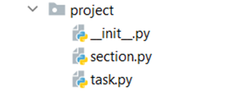

5.	To-do List
In this exercise, we are going to create a whole project step-by-step, starting with the project structure:

Create separate files for each class, as shown above. You are tasked to create two classes: 
a Task class and a Section class.
The Task class should receive a name (string) and a due_date (str) upon initialization.
A task also has two attributes: comments (empty list) and completed set to False by default.
The Task class should also have five additional methods:
-	change_name(new_name: str)
o	Changes the name of the task and returns the new name.
o	If the new name is the same as the current name, returns "Name cannot be the same."
-	change_due_date(new_date: str) 
o	Changes the due date of the task and returns the new date.
o	If the new date is the same as the current date, returns "Date cannot be the same."
-	add_comment(comment: str)
o	Adds a comment to the task.
-	edit_comment(comment_number: int, new_comment: str)
o	The comment number value represents the index of the comment we want to edit.
- The method should change the comment and return all the comments, separated by comma and space (", ")
o	If the comment number is out of range, returns "Cannot find comment."
-	details()
o	Returns the task's details in this format:
"Name: {task_name} - Due Date: {due_date}"
The Section class should receive a name (string) upon initialization. The task also
- has one instance attribute: tasks (empty list)
The Section class should also have four methods:
-	add_task(new_task: Task)
o	Adds a new task to the collection and returns "Task {task details} is added to the section"
o	If the task is already in the collection, returns "Task is already in the section {section_name}"
-	complete_task(task_name: str) 
o	Changes the task to completed (True) and returns "Completed task {task_name}"
o	If the task is not found, returns "Could not find task with the name {task_name}"
-	clean_section()
o	Removes all the completed tasks and returns "Cleared {amount of removed tasks} tasks."
-	view_section()
o	Returns information about the section and its tasks in this format:
    "Section {section_name}:
     {details of the first task}
     {details of the second task}
     …
     {details of the n task}"

_______________________________________________
Example

Test Code	(no input data in this task)

task = Task("Make bed", "27/05/2020")

print(task.change_name("Go to University"))

print(task.change_due_date("28.05.2020"))

task.add_comment("Don't forget laptop")

print(task.edit_comment(0, "Don't forget laptop and notebook"))

print(task.details())

section = Section("Daily tasks")

print(section.add_task(task))

second_task = Task("Make bed", "27/05/2020")

section.add_task(second_task)

print(section.clean_section())

print(section.view_section())
_______________________________________________
Output

Go to University

28.05.2020

Don't forget laptop and notebook

Name: Go to University - Due Date: 28.05.2020

Task Name: Go to University - Due Date: 28.05.2020 is added to the section

Cleared 0 tasks.

Section Daily tasks:

Name: Go to University - Due Date: 28.05.2020

Name: Make bed - Due Date: 27/05/2020
_______________________________________________