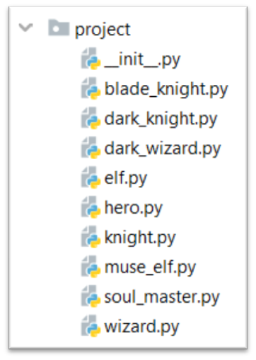

Problem description

3. Players and Monsters
   Your task is to create the following game hierarchy:

Submit in judge a zip file of the project, containing a
separate file for each of the classes using the structure shown below:

Create a class Hero. It should contain the following attributes:
• username: string
• level: int
Override the __str__() method of the base class ,so it returns:
"{name} of type {class_name} has level {level}"

_______________________________________________
Example

Test Code    (no input data in this task)

hero = Hero("H", 4)

print(hero.username)

print(hero.level)

print(str(hero))

elf = Elf("E", 4)

print(str(elf))

print(elf.__class__.__bases__[0].__name__)

print(elf.username)

print(elf.level)
_______________________________________________

Output

H

4

H of type Hero has level 4

E of type Elf has level 4

Hero

E

4

_______________________________________________