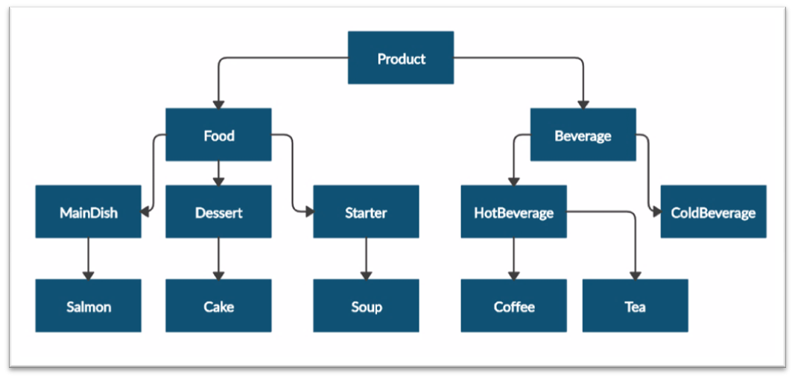
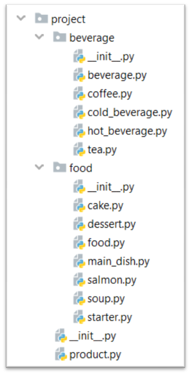

Problem description

4.	Restaurant
Create a restaurant with the following classes and hierarchy:

Submit in judge a zip file containing a separate file for each of the classes using the structure shown below:

The Product class should have the following private attributes and subsequent getters:
•	name: string
•	price: float
Beverage and Food classes are products:
•	The Beverage class should have an additional private attribute – milliliters: 
float and its subsequent getter
•	The Food class should have an additional private attribute – grams: float and its subsequent getter
HotBeverage and ColdBeverage are beverages.
Coffee and Tea are hot beverages:
•	The Coffee class should have an additional private attribute – caffeine: 
float and its subsequent getter. It should also have the following class attributes,
which should apply to all coffees made:
o	MILLILITERS = 50 (constant)
o	PRICE = 3.50 (constant)
Starter, MainDish, and Dessert are food: 
•	The Dessert class should have an additional private attribute - calories - float and its subsequent getter
 Salmon is a main dish. Also, it must have the following class attribute, which should apply to all salmons:
o	GRAMS = 22 (constant)
Soup is a starter.
Cake is a dessert. Also, it must have the following class attributes which should apply to all cakes made:
•	GRAMS = 250 (constant)
•	CALORIES = 1000 (constant)
•	PRICE = 5 (constant)

_______________________________________________
Example

Test Code	(no input data in this task)

product = Product("coffee", 2.5)

print(product.__class__.__name__)

print(product.name)

print(product.price)

beverage = Beverage("coffee", 2.5, 50)

print(beverage.__class__.__name__)

print(beverage.__class__.__bases__[0].__name__)

print(beverage.name)

print(beverage.price)

print(beverage.milliliters)

soup = Soup("fish soup", 9.90, 230)

print(soup.__class__.__name__)

print(soup.__class__.__bases__[0].__name__)

print(soup.name)

print(soup.price)

print(soup.grams)

_______________________________________________

Output

Product

coffee

2.5

Beverage

Product

coffee

2.5

50

Soup

Starter

fish soup

9.9

230

_______________________________________________

