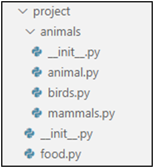

Problem description

                      4.	Wild Farm
Create the following project structure:

Your task is to create a class hierarchy like the one described below. The Animal, Bird, Mammal, and Food classes should be abstract:
In the food.py file, implement the following classes:
•	Food - the class should be abstract and should receive quantity (int) upon initialization
•	Vegetable, Fruit, Meat and Seed classes should inherit from the Food class
In the animal.py file, implement the following classes:
•	Animal - the class should be abstract and should have the following attributes:
o	name (string) - passed upon initialization
o	weight (float) - passed upon initialization
o	food_eaten - 0 by default 
•	Bird - should inherit from the Animal class. The class should be abstract and should have wing_size (float) as an additional attribute passed upon initialization.
•	Mammal - should inherit from the Animal class. The class should be abstract and should have living_region (str) as an additional attribute passed upon initialization.
In the birds.py file, implement the following classes:
•	Owl
•	Hen
In the mammals.py file, implement the following classes:
•	Mouse
•	Dog
•	Cat
•	Tiger
All animals also can ask for food by producing a sound. Create a make_sound() method that returns the sound:
•	Owl - "Hoot Hoot"
•	Hen - "Cluck"
•	Mouse - "Squeak"
•	Dog - "Woof!"
•	Cat - "Meow"
•	Tiger - "ROAR!!!"
Now use the classes that you have created to instantiate some
animals and feed them. Add method feed(food) where the food will be an instance of some food classes.
Animals will only eat a specific type of food, as follows:
•	Hens eat everything
•	Mice eat vegetables and fruits
•	Cats eat vegetables and meat
•	Tigers, Dogs, and Owls eat only meat
If you try to give an animal a different type of food, it will not eat it, and you should return:
•	"{AnimalType} does not eat {FoodType}!"
The weight of an animal will increase with every piece of food it eats, as follows:
•	Hen - 0.35
•	Owl - 0.25
•	Mouse - 0.10
•	Cat - 0.30
•	Dog - 0.40
•	Tiger - 1.00
Override the __repr__() method to print the information about an animal in the formats:
•	Birds - "{AnimalType} [{AnimalName}, {WingSize}, {AnimalWeight}, {FoodEaten}]"
•	Mammals - "{AnimalType} [{AnimalName}, {AnimalWeight}, {AnimalLivingRegion}, {FoodEaten}]"
Note: Submit all your classes and your imports in the judge system

_______________________________________________
Example_01

Test Code	(no input data in this task)

owl = Owl("Pip", 10, 10)

print(owl)

meat = Meat(4)

print(owl.make_sound())

owl.feed(meat)

veg = Vegetable(1)

print(owl.feed(veg))

print(owl)

_______________________________________________
Output

Owl [Pip, 10, 10, 0]

Hoot Hoot

Owl does not eat Vegetable!

Owl [Pip, 10, 11.0, 4]

_______________________________________________
Example_02

Test Code	(no input data in this task)

hen = Hen("Harry", 10, 10)

veg = Vegetable(3)

fruit = Fruit(5)

meat = Meat(1)

print(hen)

print(hen.make_sound())

hen.feed(veg)

hen.feed(fruit)

hen.feed(meat)

print(hen)

_______________________________________________
Output

Hen [Harry, 10, 10, 0]

Cluck

Hen [Harry, 10, 13.15, 9]
