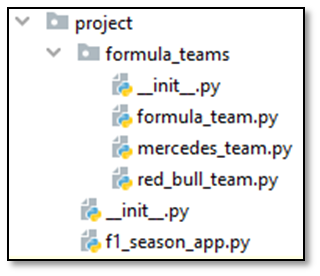

Problem description

                          *6. Formula 1 Manager

For this task, you will be provided with a skeleton that includes all the folders and files you need.

Note: You cannot change the folder and file structure and their names!
Judge Upload
Create a zip file with the project folder and upload it to the judge system.
You do not need to include in the zip file your venv, .idea, pycache, and __MACOSX (for Mac users), so you do not exceed the maximum allowed size of 16.00 KB.
Description
You are the F1 manager of the two biggest teams in F1, "Red Bull" and "Mercedes". Your task is to create a program that calculates the revenue after every race for both teams. Your app should have the following structure and functionality.
1. Class FormulaTeam
In the formula_team.py file, the class FormulaTeam should be implemented. It is a base class for any type of formula team, and it should not be able to be instantiated.
Structure
The class should have the following attribute:
•	budget: int
o	An integer that represents the budget of the team.
o	If the budget is less than 1 000 000, raise ValueError with the message: "F1 is an expensive sport, find more sponsors!"
Methods
__init__(budget: int)
•	In the __init__ method, all the needed attributes must be set.
 calculate_revenue_after_race(race_pos: int)
•	Each team should be able to calculate their revenue
•	Each team has its unique sponsors
o	Sponsors give the team money if they finish in a certain position or better
•	Each team has a different amount of expenses
2. Class RedBullTeam
In the red_bull_team.py, the class RedBullTeam should be implemented.
Methods
__init__(budget: int)
•	In the __init__ method, all the needed attributes must be set.
 calculate_revenue_after_race(race_pos: int)
•	Red Bull sponsors:
o	Oracle:
	1st place – 1 500 000$
	2nd place – 800 000$
o	Honda:
	8th place – 20 000$
	10th place – 10 000$
•	Red Bull expenses per race – 250 000$
•	To calculate the revenue from the race, sum the earned money from the sponsors depending on the position in the race and subtract the expenses
•	After that, add the result to the team's budget and return the following message: "The revenue after thе race is { revenue }$. Current budget { current budget }$"
Note: Each sponsor gives the money for the best position only. If you are 1st and the sponsor gives money for 1st and 2nd positions, you get the money only for the 1st position!
3. Class MercedesTeam
In the mercedes.py, the class MercedesTeam should be implemented.
Methods
__init__(budget: int)
•	In the __init__ method, all the needed attributes must be set.
 calculate_revenue_after_race(race_pos: int)
•	Mercedes sponsors:
o	Petronas:
	1st place – 1 000 000$
	3rd place – 500 000$
o	TeamViewer:
	5th  place – 100 000$
	7th  place – 50 000$
•	Mercedes expenses per race – 200 000$
•	To calculate the revenue from the race, sum the earned money from the sponsors depending on the position in the race and subtract the expenses
•	After that, add the result to the team's budget and return the following message: "The revenue after thе race is { revenue }$. Current budget { current budget }$"
Note: Each sponsor gives the money for the best position only. If you are 1st and the sponsor gives money for 1st and 2nd positions, you get the money only for the 1st position!
4. Class F1SeasonApp
In the f1_season_app.py file, the class F1SeasonApp should be implemented. It will contain all the functionality of the project.
Structure
The class should have the following attributes:
•	red_bull_team: RedBullTeam
o	It should be set to None on initialization.
•	mercedes_team: MercedesTeam
o	It should be set to None on initialization.
Methods
__init__()
•	In the __init__ method, all the needed attributes must be set.
register_team_for_season(team_name: str, budget: int)
•	Valid team names: "Red Bull", "Mercedes"
•	If a team name is valid, register the team with the corresponding name and return the following message: 
"{ team name } has joined the new F1 season."
•	If a team name is invalid, raise ValueError with the message: "Invalid team name!"
Note: There won't be a case where a valid team tries to register for a second time.
 new_race_results(race_name: str, red_bull_pos: int, mercedes_pos: int)
•	If Red Bull or Mercedes haven't registered yet, raise an Exception with the following message: "Not all teams have registered for the season."
•	Otherwise, find which team has the better position in the race, calculate every team's revenue, update their budget, and return the following message: "Red Bull: { Red Bull revenue message }. Mercedes: { Mercedes revenue message }. { team with better position } is ahead at the { race name } race."
•	Note: Teams' positions will always be valid.

_______________________________________________
Example

Test Code	(no input data in this task)

from project.f1_season_app import F1SeasonApp

f1_season = F1SeasonApp()

print(f1_season.register_team_for_season("Red Bull", 2000000))

print(f1_season.register_team_for_season("Mercedes", 2500000))

print(f1_season.new_race_results("Nurburgring", 1, 7))

print(f1_season.new_race_results("Silverstone", 10, 1))

_______________________________________________
Output

Red Bull has joined the new F1 season.

Mercedes has joined the new F1 season.

Red Bull: The revenue after the race is 1270000$. Current budget 3270000$. Mercedes: The revenue after the race is -150000$. Current budget 2350000$. Red Bull is ahead at the Nurburgring race.

Red Bull: The revenue after the race is -240000$. Current budget 3030000$. Mercedes: The revenue after the race is 900000$. Current budget 3250000$. Mercedes is ahead at the Silverstone race.

_______________________________________________
