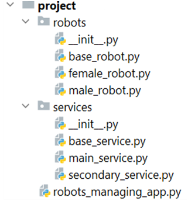

Problem description

Python OOP Exam - 8 April 2023

We are in the year 2100. Technology is so advanced that robots are all around us. They talk, eat, and do whatever you tell them to do. You are working on a robot service and you need to create a project to monitor the robot's actions. Each service has a robot that requires different care. Your job is to add, feed and take care of the robot, as well as upgrade it with various supplements.
You will be provided with a skeleton that includes all the folders and files that you will need.
Note: You are not allowed to change the folder and file structure and change their names!

Judge Upload
For the first two problems, create a zip file with the project folder and upload it to the judge system.
For the last problem, create a zip file with the test folder and upload it to the judge system.
You do not need to include in the zip file your venv, .idea, pycache, and __MACOSX (for Mac users), so you do not exceed the maximum allowed size of 16.00 KB.
Structure (Problem 1) and Functionality (Problem 2)
Our task is to implement the structure and functionality of all the classes (properties, methods, inheritance, abstraction, etc.)
You are free to add additional attributes (instance attributes, class attributes, methods, dunder methods, etc.) to simplify your code and increase readability as long as it does not change the project's final result in accordance with its requirements so that the program works properly.
1.	 Class BaseRobot
In the base_robot.py file, the class BaseRobot should be implemented. It is a base class for any type of robot, and it should not be able to be instantiated.
Structure
The class should have the following attributes: 
•	name: str
o	The value represents the name of the robot.
o	If the name is an empty string or contains only white spaces, raise a ValueError with the message: "Robot name cannot be empty!"
•	kind: str
o	The value represents the kind of the robot.
o	If the kind is an empty string or contains only white spaces, raise a ValueError with the message: "Robot kind cannot be empty!"
•	price: float
o	The value represents the price of the robot.
o	If the price is less than or equal to 0.0, raise a ValueError with the message: "Robot price cannot be less than or equal to 0.0!"
•	weight: int
o	The value represents the weight in kilograms of the robot.
Methods
__init__(name: str, kind: str, price: float, weight: int)
•	In the __init__ method, all the needed attributes must be set.
eating()
•	The method increases the robot's kilograms. Keep in mind that each kind of robot implements the method differently.
2.	Class FemaleRobot
In the female_robot.py file, the class FemaleRobot should be implemented. The female robot is a type of BaseRobot. Each female robot has 7 kilograms of weight initially.
Methods
__init__(name: str, kind: str, price: float)
•	In the __init__ method, all the needed attributes must be set.
eating()
•	The method increases the robot's weight by 1 kilogram.
3.	Class MaleRobot
In the male_robot.py file, the class MaleRobot should be implemented. The male robot is a type of BaseRobot. Each male robot has 9 kilograms of weight initially.
Methods
__init__(name: str, kind: str, price: float)
•	In the __init__ method, all the needed attributes must be set.
eating()
•	The method increases the robot's weight by 3 kilograms.
4.	Class BaseService
In the base_service.py file, the class BaseService should be implemented. It is a base class for any type of service, and it should not be able to be instantiated.
Structure
The class should have the following attributes: 
•	name: str
o	The value represents the name of the service.
o	If the name is an empty string or contains only white spaces, raise a ValueError with the message: "Service name cannot be empty!"
•	capacity: int
o	The value represents the number of robots а service can have.
o	If the capacity is less than or equal to 0, raise a ValueError with the message: "Service capacity cannot be less than or equal to 0!"
•	robots: list
o	Empty list that will contain robots (objects) added to the service.
Methods
__init__(name: str, capacity: int)
•	In the __init__ method, all the needed attributes must be set.
details()
•	Returns a string with information about the service depending on its type.
5.	Class MainService
In the main_service.py file, the class MainService should be implemented. Main service is a type of BaseService. Each main service has a capacity of 30.
Methods
__init__(name: str)
•	In the __init__ method, all the needed attributes must be set.
details()
•	Returns a string in the following format:
"{service_name} Main Service:
Robots: {robot_name1} {robot_name2} … {robot_nameN}"
•	If the service doesn't have any robots, add "none" instead of the robots' names:
"{service_name} Main Service:
Robots: none"
6.	Class SecondaryService
In the secondary_service.py file, the class SecondaryService should be implemented. Secondary service is a type of BaseService. Each secondary service has a capacity of 15.
Methods
__init__(name: str)
•	In the __init__ method, all the needed attributes must be set.
details()
•	Returns a string in the following format:
"{service_name} Secondary Service:
Robots: {robot_name1} {robot_name2} … {robot_nameN}"
•	If the service doesn't have any robots, add "none" instead of the robots' names:
"{service_name} Secondary Service:
Robots: none"
7.	Class RobotsManagingApp
In the robots_managing_app.py file, the class RobotsManagingApp should be implemented. It will contain the functionality of the project.
Structure
The class should have the following attributes:
•	robots: list
o	Empty list that will contain all robots (objects) that are created.
•	services: list
o	Empty list that will contain all services (objects) that are created.
Methods
__init__()
•	In the __init__ method, all the needed attributes must be set.
add_service(service_type: str, name: str)
The method creates a service of the given type and adds it to the services collection. 
All service names will be unique.
•	If the service type is not valid, raise an Exception with the following message:
"Invalid service type!"
•	Otherwise, create the service, add it to the services list, and return the following message:
"{service_type} is successfully added."
•	Valid types of services are: "MainService" and "SecondaryService"
add_robot(robot_type: str, name: str, kind: str, price: float)
The method creates a robot of the given type and adds it to the robots' collection. 
All robots' names will be unique.
•	If the robot type is not valid, raise an Exception with the following message:
"Invalid robot type!"
•	Otherwise, create the robot, add it to the robots' list, and return the following message:
"{robot_type} is successfully added."
•	Valid types of robots are: "MaleRobot" and "FemaleRobot"
add_robot_to_service(robot_name: str, service_name: str)
The method adds the robot with the given name to the service if there is a capacity for that. Both robot and service with the given names will always exist.
•	First, check if the robot can be added to the service. The Female robot can be ONLY added to the Secondary Service and the Male robot can be ONLY added to the Main Service. In case of a mismatch, return the message: "Unsuitable service."
•	Next, if there is NOT enough capacity to add the robot to the service, raise an Exception with the following message: "Not enough capacity for this robot!"
•	If the robot can be added successfully to the service, remove it from the robots' collection, and add it to the service. Return the following message: "Successfully added {robot_name} to {service_name}."
remove_robot_from_service(robot_name: str, service_name: str)
The method removes the robot with the given name from the service. The service with the given name will always exist.
•	Check if there is a robot with the given name in the service. If not, raise an Exception with the following message: "No such robot in this service!"
•	If the robot can be removed successfully from the service, remove it from the service, and add it back to the robots' collection. Return the following message: "Successfully removed {robot_name} from {service_name}."
feed_all_robots_from_service(service_name: str)
The method feeds all robots from the service. The service with the given name will always exist. When all robots from the service are successfully fed (hint: use eating() method), return the following message: 
"Robots fed: {number_of_robots_fed}."
service_price(service_name: str)
The method calculates the price of all robots that are in the service. The service with the given name will always exist. 
Return the calculated price, formatted to the second decimal place with the following message:
"The value of service {service_name} is {total_price}."
__str__()
Returns information about each service (hint: you can use the service details() method)
"{service_name1} {service_type}:
Robots: {robot_name1} {robot_name2} … {robot_nameN}
{service_name2} {service_type}:
Robots: {robot_name1} {robot_name2} … {robot_nameN}
…
{service_nameN} {service_type}:
Robots: {robot_name1} {robot_name2} … {robot_nameN}"

_______________________________________________
Example

main_app = RobotsManagingApp()
print(main_app.add_service('SecondaryService', 'ServiceRobotsWorld'))
print(main_app.add_service('MainService', 'ServiceTechnicalsWorld'))
print(main_app.add_robot('FemaleRobot', 'Scrap', 'HouseholdRobots', 321.26))
print(main_app.add_robot('FemaleRobot', 'Sparkle', 'FunnyRobots', 211.11))

print(main_app.add_robot_to_service('Scrap', 'ServiceRobotsWorld'))
print(main_app.add_robot_to_service('Sparkle', 'ServiceRobotsWorld'))

print(main_app.feed_all_robots_from_service('ServiceRobotsWorld'))
print(main_app.feed_all_robots_from_service('ServiceTechnicalsWorld'))

print(main_app.service_price('ServiceRobotsWorld'))
print(main_app.service_price('ServiceTechnicalsWorld'))

print(str(main_app))

print(main_app.remove_robot_from_service('Scrap', 'ServiceRobotsWorld'))
print(main_app.service_price('ServiceRobotsWorld'))
print(main_app.service_price('ServiceTechnicalsWorld'))

print(str(main_app))

_______________________________________________
Output

SecondaryService is successfully added.
MainService is successfully added.
FemaleRobot is successfully added.
FemaleRobot is successfully added.
Successfully added Scrap to ServiceRobotsWorld.
Successfully added Sparkle to ServiceRobotsWorld.
Robots fed: 2.
Robots fed: 0.
The value of service ServiceRobotsWorld is 532.37.
The value of service ServiceTechnicalsWorld is 0.00.
ServiceRobotsWorld Secondary Service:
Robots: Scrap Sparkle
ServiceTechnicalsWorld Main Service:
Robots: none
Successfully removed Scrap from ServiceRobotsWorld.
The value of service ServiceRobotsWorld is 211.11.
The value of service ServiceTechnicalsWorld is 0.00.
ServiceRobotsWorld Secondary Service:
Robots: Sparkle
ServiceTechnicalsWorld Main Service:
Robots: none

_______________________________________________

Task 3: Unit Tests (100 points)

You will be provided with another skeleton for this problem. Open the new skeleton as a new project and write tests for the TennisPlayer class. The class will have some methods, fields and one constructor, all of them working properly. You are NOT ALLOWED to change anything in the class. Cover the whole class with unit tests to make sure that the class is working as intended. Submit only the test folder as zip archive.

_______________________________________________