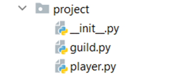

6.	Guild System
You are tasked to create two classes: a Player class and a Guild class. 

!

The Player class should receive a name (string), a hp (int), and a mp (int) upon initialization. 
The Player also has 2 instance attributes: skills (empty dictionary that will 
contain the skills of each player and its mana cost) and a guild set to "Unaffiliated" by default.
The Player class should also have two additional methods:
-	add_skill(skill_name, mana_cost)
o	Adds the skill and the corresponding mana cost to the dictionary of skills.
- Returns "Skill {skill_name} added to the collection of the player {player_name}"
o	If the skill is already in the collection, returns "Skill already added"
-	player_info() 
o	Returns the player's information, including their skills, in this format:
"Name: {player_name}
 Guild: {guild_name}
 HP: {hp}
 MP: {mp}
 ==={skill_name_1} - {skill_mana_cost}
 ==={skill_name_2} - {skill_mana_cost}
 …
 ==={skill_name_N} - {skill_mana_cost}"

The Guild class receives a name (string). The Guild should also have one instance attribute players (an empty list which will contain the players of the guild). The class also has 3 additional methods:
-	assign_player(player: Player)
o	Adds the player to the guild and returns "Welcome player {player_name} to the guild {guild_name}". Remember to change the player's guild in the player class.
o	If he is already in the guild, returns "Player {player_name} is already in the guild."
o	If the player is in another guild, returns "Player {player_name} is in another guild."
-	kick_player(player_name: str)
o	Removes the player from the guild and returns "Player {player_name} has been removed from the guild.". Remember to change the player's guild in the player class to "Unaffiliated".
o	If there is no such player in the guild, returns "Player {player_name} is not in the guild."
-	guild_info() 
o	Returns the guild's information, including the players in the guild, in the format:
"Guild: {guild_name}
{first_player's info}
…
{Nplayer's info}"

_______________________________________________
Example

Test Code	(no input data in this task)

player = Player("George", 50, 100)
print(player.add_skill("Shield Break", 20))
print(player.player_info())
guild = Guild("UGT")
print(guild.assign_player(player))
print(guild.guild_info())

Output

Skill Shield Break added to the collection of the player George
Name: George
Guild: Unaffiliated
HP: 50
MP: 100
===Shield Break - 20

Welcome player George to the guild UGT
Guild: UGT
Name: George
Guild: UGT
HP: 50
MP: 100
===Shield Break - 20
