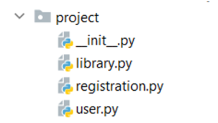

8.	Library*

Create a class called Library, where the information regarding the users and books
rented/available will be stored. Create another one called User, where the information 
for each of the library users will be stored, and Registration class, where user information 
will be administrated (created/edited/deleted) and stored in the Library records.

Class User
In the user.py file, create class User. Upon initialization, it should receive user_id (int) and 
username (string). The class should also have an instance attribute books that is an empty list.
You should also create 2 instance methods:
-	info() - returns a string containing the books currently rented by the user in ascending order 
- separated by comma and space.
-	__str__() - override the method to get a string in the following format "{user_id}, {username}, 
- {list of rented books}"
Class Library
In the library.py create a class Library. Upon initialization, it will not receive anything, but it 
- should have the following instance attributes: 
o	user_records - an empty list that will store the users (users objects) of the library
o	books_available - an empty dictionary that will keep information regarding the
- authors (key: str) and the books available for each of the authors (list of strings)
o	rented_books - an empty dictionary that will keep information regarding the 
- usernames (key: str) and nested dictionary as a value in which will keep information 
- regarding the book names (key: str) and days left before returning the book to the 
- library (int) - ({usernames: {book names: days to return}}).
You should also create 2 additional instance methods:
-	get_book(author: str, book_name: str, days_to_return: int, user: User):
o	If the book is available in the library adds it to the books list for this user, 
- updates the library records (rented_books and available_books dicts), and returns 
- the following message: "{book_name} successfully rented for the next {days_to_return} days!"
o	If it is already rented, returns the following message "The book "{book_name}" 
- is already rented and will be available in {days_to_return provided by the user rented the book} days!"
-	return_book(author:str, book_name:str, user: User):
o	If the book is in the user's books list, returns it in the library 
- (update books_available and rented_books class attributes) 
- and removes it from the books list for this user
o	Otherwise, returns the following message "{username} doesn't have this book in his/her records!"
Class Registration 
In the registration.py, create a class called Registration. Upon initialization, 
- It will not receive anything, but we'll have these three methods.
-	add_user(user: User, library: Library):
o	Adds the user if we do not have them in the library's user records already
o	Otherwise, returns the message "User with id = {user_id} already registered in the library!"
-	remove_user(user: User, library: Library):
o	Removes the user from the library records if present
o	Otherwise, returns the message "We could not find such user to remove!"
-	change_username(user_id: int, new_username: str, library: Library):
o	If there is a record with the same user id in the library and the username 
- is different than the provided one, changes the username with the new one provided and returns the
- message "Username successfully changed to: {new_username} for user id: {user_id}". 
- Changes his username in the rented_books dictionary as well (if present).
o	If the new username is the same for this id, returns the following message 
- "Please check again the provided username - it should be different than the username used so far!".
o	If there is no record for the provided id returns "There is no user with id = {user_id}!"

_______________________________________________
Example_01

Test Code	(no input data in this task)

 
user = User(12, 'Peter')
library = Library()
registration = Registration()
registration.add_user(user, library)
print(registration.add_user(user, library))
registration.remove_user(user, library)
print(registration.remove_user(user, library))
registration.add_user(user, library)
print(registration.change_username(2, 'Igor', library))
print(registration.change_username(12, 'Peter', library))
print(registration.change_username(12, 'George', library))
 
[print(f'{user_record.user_id}, {user_record.username}, {user_record.books}') for user_record in library.user_records]
 
 
library.books_available.update({'J.K.Rowling': ['The Chamber of Secrets',
                                                'The Prisoner of Azkaban',
                                                'The Goblet of Fire',
                                                'The Order of the Phoenix',
                                                'The Half-Blood Prince',
                                                'The Deathly Hallows']})
library.get_book('J.K.Rowling', 'The Deathly Hallows', 17, user)
print(library.books_available)

Output

User with id = 12 already registered in the library!
We could not find such user to remove!
There is no user with id = 2!
Please check again the provided username - it should be different than the username used so far!
Username successfully changed to: George for user id: 12
12, George, []
{'J.K.Rowling': ['The Chamber of Secrets', 'The Prisoner of Azkaban', 'The Goblet of Fire', 'The Order of the Phoenix', 'The Half-Blood Prince']}
{'George': {'The Deathly Hallows': 17}}
['The Deathly Hallows']
The book "The Deathly Hallows" is already rented and will be available in 17 days!
George doesn't have this book in his/her records!
{'J.K.Rowling': ['The Chamber of Secrets', 'The Prisoner of Azkaban', 'The Goblet of Fire', 'The Order of the Phoenix', 'The Half-Blood Prince', 'The Deathly Hallows']}
{'George': {}}
[]

_______________________________________________
Example_02

Test Code	(no input data in this task)

from project.library import Library
from project.user import User
from project.registration import Registration
 

user = User(12, 'Peter')
library = Library()
registration = Registration()
registration.add_user(user, library)
library.books_available.update({'J.K.Rowling': ['The Chamber of Secrets',
                                                'The Prisoner of Azkaban',
                                                'The Goblet of Fire',
                                                'The Order of the Phoenix',
                                                'The Half-Blood Prince',
                                                'The Deathly Hallows']})
library.get_book('J.K.Rowling', 'The Deathly Hallows', 10, user)
print(user)

Output

12, Peter, ['The Deathly Hallows']