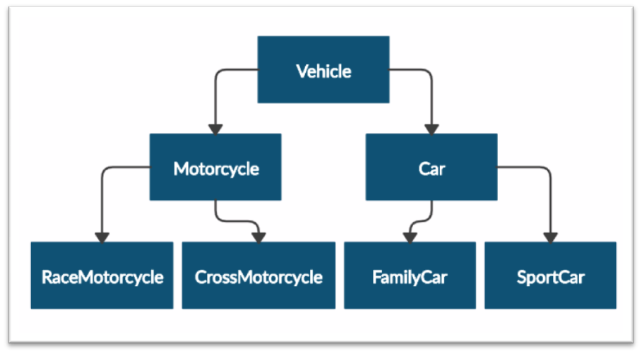

Problem description

4.	Need for Speed
Create the following hierarchy with the following classes: 
 
Submit in judge a zip file of the project, containing a
separate file for each of the classes using the structure shown below:

Create a base class Vehicle. It should contain the following attributes:
•	DEFAULT_FUEL_CONSUMPTION: float (constant)
•	fuel_consumption: float - represents the fuel consumption per kilometer
•	fuel: float - represents the quantity of fuel in a specific vehicle
•	horse_power: int
Upon initialization, the class should receive fuel and horse_power. 
The DEFAULT_FUEL_CONSUMPTION value should be set to the fuel_consumption value. 
Each class should have the following methods:
•	drive(kilometers) - reduces the fuel based on the traveled kilometers and fuel 
consumption (km * fuel consumption). Keep in mind that you can start driving the vehicle 
only if you have enough fuel to finish the driving.
The default fuel consumption for the different vehicles is:
•	Vehicle is 1.25
•	SportCar is 10
•	RaceMotorcycle is 8
•	Car is 3

_______________________________________________
Example

Test Code	(no input data in this task)

 
vehicle = Vehicle(50, 150)

print(Vehicle.DEFAULT_FUEL_CONSUMPTION)

print(FamilyCar.DEFAULT_FUEL_CONSUMPTION)

print(vehicle.fuel)

print(vehicle.horse_power)

print(vehicle.fuel_consumption)

vehicle.drive(100)

print(vehicle.fuel)

family_car = FamilyCar(150, 150)

family_car.drive(50)

print(family_car.fuel)

family_car.drive(50)

print(family_car.fuel)

print(family_car.__class__.__bases__[0].__name__)

Output

1.25

3

50

150

1.25

50

0

0

Car

