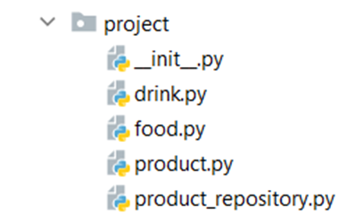

Problem description

5.	Shop
Maria is expanding her business, and today, she is opening a grocery shop.
You are hired to write a program that 

In the product.py file, the class Product should be implemented. It is a base class for any 
type of food and drink.
The class should receive name: str, and quantity: int upon initialization. 
It should also have 3 additional methods:
•	decrease(quantity: int) - decreases the quantity of the product only if there is enough
•	increase(quantity: int) - increases the quantity of the product
•	__repr__() - override the method, so it returns the name of the product 
In the file drink.py, the class Drink should be implemented. T
he class should inherit from the Product class. An instance of the Drink class 
will have a name and a quantity of 10.
In the food.py file, the Food class should be implemented. The class should inherit 
from the Product class. An instance of the Food class will have a name and a quantity of 15.
In the product_repository.py file, the class ProductRepository should be implemented. 
It is a repository for all products that are delivered to the grocery shop.
The class should have products: list - an empty list, which will be containing all products (objects). 
Also, the class should have 4 additional methods:
•	add(product: Product) - adds a product to the repository
•	find(product_name: str) - returns a product (object) with that name
•	remove(product_name) - removes a product from the repository
•	__repr__() - override the method, so it returns information for all products in the repository: 
"{product_name1}: {quantity1}"
{product_name2}: {quantity2}
…
{product_nameN}: {quantityN}"

_______________________________________________
Example

Test Code	(no input data in this task)

 
food = Food("apple")

drink = Drink("water")

repo = ProductRepository()

repo.add(food)

repo.add(drink)

print(repo.products)

print(repo.find("water"))

repo.find("apple").decrease(5)

print(repo)

Output

[apple, water]

water

apple: 10

water: 10

