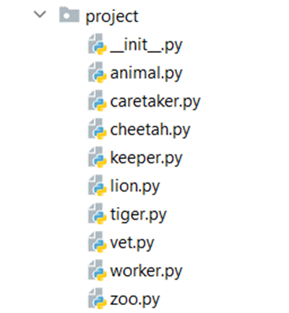

Problem description

       1.	Wild Cat Zoo

Create a separate file for each class as shown below and submit a zip file containing
all files (zip the whole project folder/module) - it is important to include all files 
in the project module to make proper imports.

The Animal class is a base class for any type of animal in the zoo. 
It should receive four public attributes - a name (string), a gender (str), 
an age (int), and a money_for_care (int) upon initialization.
The Animal class should also have 1 additional method:
•	__repr__() - returns string representation of the animal in the format: 
"Name: {name}, Age: {age}, Gender: {gender}"
The Lion, the Tiger, and the Cheetah classes should inherit from the Animal class.
Each of these animals costs a certain amount of money to be cared for:
•	A lion needs 50
•	A tiger needs 45
•	A cheetah needs 60
The Worker class is a base class for any type of employee in the zoo. It should receive three public attributes - a name (string), an age (int), and a salary (int) upon initialization.
The Worker class should also have one method:
•	__repr__() - returns string representation of the workers in the format: "Name: {name}, Age: {age}, Salary: {salary}"
The Keeper, the Caretaker, and the Vet classes should inherit from the Worker class.
The Zoo class should receive 4 attributes upon initialization:
•	Public attribute name: string
•	Private attribute budget: int
•	Private attribute animal_capacity: int
•	Private attribute workers_capacity: int
It should also have 2 instance attributes:
•	Public attribute animals: list - (empty upon initialization)
•	Public attribute workers: list - (empty upon initialization)
The Zoo class should also have 8 methods:
•	add_animal(animal, price)
o	If you have enough budget and capacity add the animal (instance of Lion/Tiger/Cheetah) 
to the animals' list, reduce the budget, and return "{name} the {type of animal 
(Lion/Tiger/Cheetah)} added to the zoo"
o	If you have the capacity, but no budget, return "Not enough budget"
o	In any other case, you do not have space, and you should return "Not enough space for animal"
•	hire_worker(worker)
o	If you have not exceeded the capacity of workers in the zoo for the worker 
(instance of Keeper/Caretaker/Vet), add him to the workers and return "{name} the {type(Keeper/Vet/Caretaker)} hired successfully"
o	Otherwise, return "Not enough space for worker"
•	fire_worker(worker_name)
o	If there is a worker with that name in the workers' list, remove him and
return "{worker_name} fired successfully"
o	Otherwise, return "There is no {worker_name} in the zoo"
•	pay_workers()
o	If you have enough budget to pay the workers (sum their salaries) pay them 
and return "You payed your workers. They are happy. Budget left: {left_budget}"
o	Otherwise, return "You have no budget to pay your workers. They are unhappy"
•	tend_animals()
o	If you have enough budget to take care of the animals, reduce the budget and return 
"You tended all the animals. They are happy. Budget left: {left_budget}"
o	Otherwise, return "You have no budget to tend the animals. They are unhappy."
•	profit(amount)
o	Increase the budget with the given amount of profit
•	animals_status()
o	Returns the following string (Hint: use the __repr__ methods of the animals to print them on the console):
"You have {total_animals_count} animals
----- {amount_of_lions} Lions:
{lion1}
…
{lionN}
----- {amount_of_tigers} Tigers:
{tiger1}
…
{tigerN}
----- {amount_of_cheetahs} Cheetahs:
{cheetah1}
…
{cheetahN}"
•	workers_status()
o	Returns the following string (Hint: use the __repr__ methods of the
workers to print them on the console):
"You have {total_workers_count} workers
----- {amount_of_keepers} Keepers:
{keeper1}
…
{keeperN}
----- {amount_of_caretakers} Caretakers:
{caretaker1}
…
{caretakerN}
----- {amount_of_vetes} Vets:
{vet1}
…
{vetN}"

_______________________________________________
Example

Test Code	(no input data in this task)

 from project.caretaker import Caretaker
from project.cheetah import Cheetah
from project.keeper import Keeper
from project.lion import Lion
from project.tiger import Tiger
from project.vet import Vet
from project.zoo import Zoo

zoo = Zoo("Zootopia", 3000, 5, 8)

# Animals creation
animals = [Cheetah("Cheeto", "Male", 2), Cheetah("Cheetia", "Female", 1), Lion("Simba", "Male", 4), Tiger("Zuba", "Male", 3), Tiger("Tigeria", "Female", 1), Lion("Nala", "Female", 4)]

# Animal prices
prices = [200, 190, 204, 156, 211, 140]

# Workers creation
workers = [Keeper("John", 26, 100), Keeper("Adam", 29, 80), Keeper("Anna", 31, 95), Caretaker("Bill", 21, 68), Caretaker("Marie", 32, 105), Caretaker("Stacy", 35, 140), Vet("Peter", 40, 300), Vet("Kasey", 37, 280), Vet("Sam", 29, 220)]

# Adding all animals
for i in range(len(animals)):
    animal = animals[i]
    price = prices[i]
    print(zoo.add_animal(animal, price))

# Adding all workers
for worker in workers:

Output

Cheeto the Cheetah added to the zoo

Cheetia the Cheetah added to the zoo

Simba the Lion added to the zoo

Zuba the Tiger added to the zoo

Tigeria the Tiger added to the zoo

Not enough space for animal

John the Keeper hired successfully

Adam the Keeper hired successfully

Anna the Keeper hired successfully

Bill the Caretaker hired successfully

Marie the Caretaker hired successfully

Stacy the Caretaker hired successfully

Peter the Vet hired successfully

Kasey the Vet hired successfully

Not enough space for worker

You tended all the animals. They are happy. Budget left: 1779

You payed your workers. They are happy. Budget left: 611

Adam fired successfully
You have 5 animals

----- 1 Lions:

Name: Simba, Age: 4, Gender: Male

----- 2 Tigers:

Name: Zuba, Age: 3, Gender: Male

Name: Tigeria, Age: 1, Gender: Female

----- 2 Cheetahs:

Name: Cheeto, Age: 2, Gender: Male

Name: Cheetia, Age: 1, Gender: Female

You have 7 workers

----- 2 Keepers:

Name: John, Age: 26, Salary: 100

Name: Anna, Age: 31, Salary: 95

----- 3 Caretakers:

Name: Bill, Age: 21, Salary: 68

Name: Marie, Age: 32, Salary: 105

Name: Stacy, Age: 35, Salary: 140

----- 2 Vets:

Name: Peter, Age: 40, Salary: 300

Name: Kasey, Age: 37, Salary: 280

