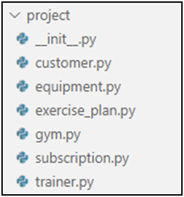

Problem description

       4.	Gym
Create the following project structure:

Class Customer
Upon initialization, each customer will receive the following 
parameters: name: str, address: str, email: str. Each customer
should also have a personal id (autoincremented, starting from 1). 
To do the incrementation, you should create a class attribute id equal to 1, 
which will keep the value of the id for the upcoming customer. For example,
if there are no customers, the class id should be equal to 1. When there is 
one customer - the class id should be equal to 2.
Create a method called get_next_id, which returns the id that will be given 
to the next customer.
Implement the __repr__ method so it returns the info about the customer in 
the following format: "Customer <{id}> {name}; Address: {address}; Email: {email}"
Class Equipment
Upon initialization, the class will receive the following
parameters: name: str. Each equipment should also have a
n id (autoincremented, starting from 1). To do the incrementation, you should 
create a class attribute id equal to 1, which will keep the value of the id
for the following equipment's id. 
Create a method called get_next_id, which returns the id that will be given
to the following equipment.
Implement the __repr__ method so it returns the info about the equipment
in the following format: "Equipment <{id}> {name}"
Create a static method called get_next_id, which returns the id that will
be given to the following equipment.
Class ExercisePlan
Upon initialization, the class will receive the following
parameters: trainer_id: int, equipment_id: int, duration: int (in minutes).
Each plan should also have an id (autoincremented, starting from 1). 
To do the incrementation, you should create a class attribute id equal to 1,
which will keep the value of the id for the next plan's id. Create the following methods:
•	from_hours(trainer_id:int, equipment_id:int, hours:int) - creates new
instance using the provided information
•	get_next_id() - static method that returns the id that will be given to the next plan
•	__repr__() - returns the information about the plan in the following 
format: "Plan <{id}> with duration {duration} minutes"
Class Subscription
Upon initialization, the class will receive the following
parameters: date: str, customer_id: int, trainer_id: int, exercise_id: int. 
The class should also have an id (autoincremented starting from 1). To do the 
incrementation, you should create a class attribute id equal to 1, which will
keep the value of the id for the next subscription's id.
Implement the __repr__ method so it returns the info about the subscription in the following format: "Subscription <{id}> on {date}"
Create a static method called get_next_id which returns the id that will be 
given to the next subscription
Class Trainer
Upon initialization, the class will receive the following 
parameters: name: str. The class should also have an id (autoincremented starting from 1). 
To do the incrementation, you should create a class attribute id equal to 1, which will
keep the value of the id for the next trainer's id.
Implement the __repr__ method so it returns the info about the trainer in the following 
format: "Trainer <{id}> {name}"
Create a static method called get_next_id, which returns the id that will be given to the next trainer.
Class Gym
Upon initialization, the class will not receive any parameters. However, it should have 
the following attributes: customers (empty  list of customer objects), trainers 
(empty list of trainer objects), equipment (empty list of equipment objects), plans 
(empty list of plan objects), subscriptions (empty list of subscription objects)
Create the following methods:
•	add_customer(customer: Customer) - add the customer in the customer list if 
the customer is not already in it
•	add_trainer(trainer: Trainer) - add the trainer to the trainers' list, if the
trainer is not already in it
•	add_equipment(equipment: Equipment) - add the equipment to the equipment list,
if the equipment is not already in it
•	add_plan(plan: ExercisePlan) - add the plan to the plans' list, if the plan is not already in it
•	add_subscription(subscription: Subscription) - add the subscription in the
subscriptions list if the subscription is not already in it
•	subscription_info(subscription_id: int) - get the subscription, the customer,
the trainer, the equipment, and the plan. Then return their string representations each on a new line.
Examples

_______________________________________________
Example

Test Code	(no input data in this task)

from project.customer import Customer

from project.equipment import Equipment

from project.exercise_plan import ExercisePlan

from project.gym import Gym

from project.subscription import Subscription

from project.trainer import Trainer

customer = Customer("John", "Maple Street", "john.smith@gmail.com")

equipment = Equipment("Treadmill")

trainer = Trainer("Peter")

subscription = Subscription("14.05.2020", 1, 1, 1)

plan = ExercisePlan(1, 1, 20)

gym = Gym()

gym.add_customer(customer)

gym.add_equipment(equipment)

gym.add_trainer(trainer)

gym.add_plan(plan)

gym.add_subscription(subscription)

print(Customer.get_next_id())

print(gym.subscription_info(1))

_______________________________________________
Output

2

Subscription <1> on 14.05.2020

Customer <1> John; Address: Maple Street; Email: john.smith@gmail.com

Trainer <1> Peter

Equipment <1> Treadmill

Plan <1> with duration 20 minutes

_______________________________________________