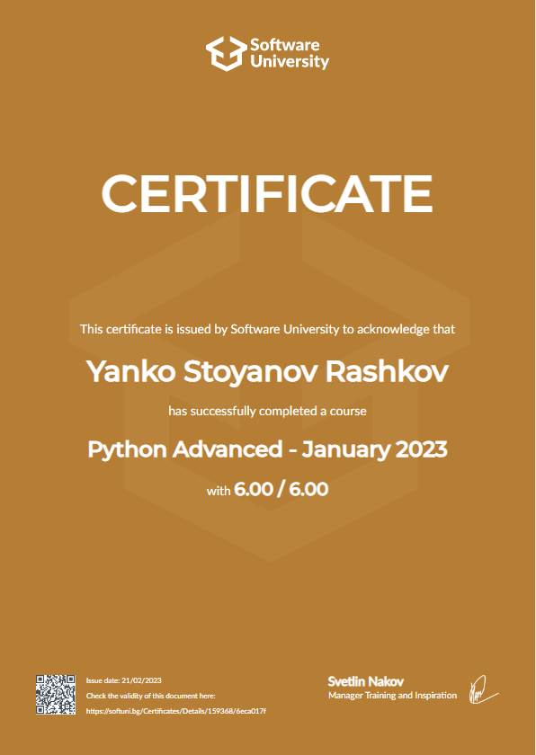

# Advanced and OOP-Python

This is my Advanced and OOP module of programing with Python.

[Python Advanced and OOP - January2023](https://softuni.bg/modules/74/python-advanced/1382)

This is a part from my education in [SoftUni](https://about.softuni.bg/). 

Every code in this folder is written on Python and is free for everyone to use it!

Result of Python Advanced: (Python OOP - in progress)

